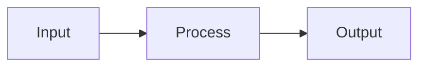

# Documentation Templates

## Feature Documentation Template

```markdown
# [Feature Name]

## Overview
[1-2 sentence description of what this feature does]

## Purpose
[Why this feature exists, what problem it solves]

## Architecture

### Components
- `ComponentA` - [purpose]
- `ComponentB` - [purpose]

### Data Flow


## Usage

### Basic Example
```dart
// Example code
```

### Advanced Example
```dart
// More complex example
```

## Configuration

| Option | Type | Default | Description |
|--------|------|---------|-------------|
| option1 | String | "default" | Description |

## Related
- [RelatedFeature](../related/README.md)
- [AppServices]

## Changelog
- [Date]: Initial implementation
```

## API Documentation Template

```markdown
# [API Name]

## Endpoint
`POST /functions/v1/[name]`

## Authentication
Requires JWT token in Authorization header.

## Request

### Headers
| Header | Required | Description |
|--------|----------|-------------|
| Authorization | Yes | Bearer token |

### Body
```json
{
  "param1": "string",
  "param2": 123
}
```

## Response

### Success (200)
```json
{
  "success": true,
  "data": {}
}
```

### Error (4xx/5xx)
```json
{
  "success": false,
  "error": "Error message"
}
```

## Examples

### cURL
```bash
curl -X POST https://api.example.com/functions/v1/name \
  -H "Authorization: Bearer $TOKEN" \
  -d '{"param1": "value"}'
```

### Dart
```dart
final response = await appServices.api.callFunction(
  'name',
  body: {'param1': 'value'},
);
```
```

## Module Documentation Template

```markdown
# [Module Name] Module

## Overview
[Description of the module's purpose]

## Directory Structure
```
lib/bukeer/[module]/
├── screens/
│   └── [screen]_screen.dart
├── widgets/
│   └── [widget]_widget.dart
├── models/
│   └── [model].dart
└── services/
    └── [service]_service.dart
```

## Key Components

### Screens
- `[Screen]Screen` - [purpose]

### Widgets
- `[Widget]Widget` - [purpose]

### Services
- `[Service]Service` - [purpose]

## Dependencies
- [AppServices]
- [Other dependencies]

## Usage

### Navigation
```dart
context.go('/[module]');
context.push('/[module]/details', extra: id);
```

### Service Access
```dart
final data = await appServices.[module].getAll();
```

## Permissions
- `can[Action][Module]()` - Required for [action]

## Related Modules
- [RelatedModule](../related/README.md)
```

## Architecture Decision Record (ADR) Template

```markdown
# ADR-[NUMBER]: [Title]

## Status
[Proposed | Accepted | Deprecated | Superseded]

## Date
[YYYY-MM-DD]

## Context
[What is the issue that we're seeing that is motivating this decision?]

## Decision
[What is the change that we're proposing/have agreed to implement?]

## Consequences

### Positive
- [Benefit 1]
- [Benefit 2]

### Negative
- [Drawback 1]
- [Drawback 2]

### Neutral
- [Observation]

## Alternatives Considered
1. [Alternative 1] - [Why rejected]
2. [Alternative 2] - [Why rejected]

## Related
- [ADR-X](./ADR-X.md)
- [Issue #Y](link)
```

## Quick Reference Template

```markdown
# [Topic] Quick Reference

## Common Tasks

### [Task 1]
```dart
// Code
```

### [Task 2]
```dart
// Code
```

## Cheat Sheet

| Action | Code |
|--------|------|
| Action 1 | `code` |
| Action 2 | `code` |

## Common Errors

### [Error 1]
**Cause**: [cause]
**Solution**: [solution]

## See Also
- [Detailed Guide](./GUIDE.md)
```

## Checklist Template

```markdown
# [Process] Checklist

## Pre-[Process]
- [ ] [Step 1]
- [ ] [Step 2]

## During [Process]
- [ ] [Step 1]
- [ ] [Step 2]

## Post-[Process]
- [ ] [Step 1]
- [ ] [Step 2]

## Validation
- [ ] [Check 1]
- [ ] [Check 2]
```
