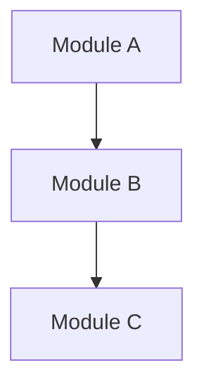
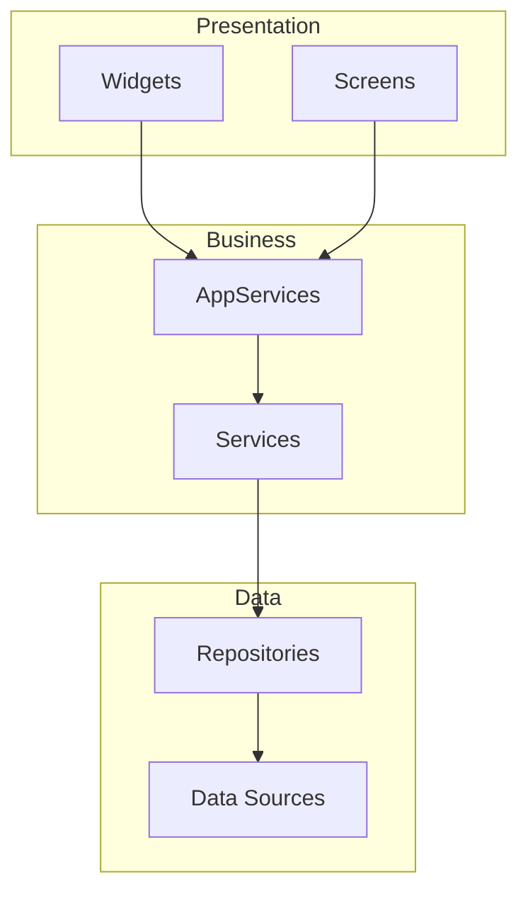
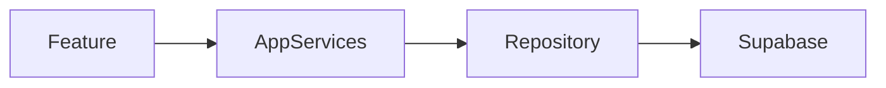

# Architecture Analysis Report Format

## Standard Report Template

```markdown
# Architectural Analysis Report

## Executive Summary
[Brief overview of findings and critical issues]

## Scope
- **Module(s) Analyzed**: [list]
- **Files Reviewed**: [count]
- **Analysis Date**: [date]

## Compliance with ARCHITECTURE.md

### Pattern Compliance
| Pattern | Status | Notes |
|---------|--------|-------|
| AppServices | ✅/⚠️/❌ | [details] |
| Repository | ✅/⚠️/❌ | [details] |
| Error Handling | ✅/⚠️/❌ | [details] |
| Permission Checks | ✅/⚠️/❌ | [details] |

### Layer Separation
- **Presentation Layer**: [status]
- **Business Logic Layer**: [status]
- **Data Layer**: [status]

## Identified Violations

### Critical Issues
1. **[Violation Type]**: [Description]
   - Location: `file_path:line_number`
   - Impact: Critical
   - Recommendation: [specific fix]

### High Priority Issues
1. **[Violation Type]**: [Description]
   - Location: `file_path:line_number`
   - Impact: High
   - Recommendation: [specific fix]

### Medium Priority Issues
[List with same format]

### Low Priority Issues
[List with same format]

## Architecture Strengths
- [What's working well]
- [Good patterns observed]

## Improvement Opportunities

### 1. [Area]
- **Current State**: [description]
- **Recommended State**: [description]
- **Benefits**: [expected improvements]
- **Implementation Effort**: High/Medium/Low

### 2. [Area]
[Same format]

## Dependency Analysis

### Module Dependencies


### Issues Found
- [Circular dependencies]
- [Tight coupling]
- [Missing abstractions]

## Performance Considerations
- [Lazy loading status]
- [Caching opportunities]
- [Query optimization needs]

## Action Items

### Immediate (Critical)
- [ ] [Task with owner]

### Short-term (High)
- [ ] [Task with owner]

### Medium-term (Medium)
- [ ] [Task with owner]

### Backlog (Low)
- [ ] [Task]
```

## Quick Analysis Template

For smaller reviews:

```markdown
# Quick Architecture Review: [Module Name]

## Summary
[1-2 sentence overview]

## Status: ✅ PASS / ⚠️ NEEDS ATTENTION / ❌ FAIL

## Key Findings
1. [Finding 1]
2. [Finding 2]

## Recommendations
1. [Recommendation 1]
2. [Recommendation 2]

## Next Steps
- [Action item]
```

## Mermaid Diagram Templates

### Component Diagram



### Dependency Flow



## Report Checklist

Before finalizing report:

- [ ] All violations have file:line references
- [ ] Impact levels assigned to all issues
- [ ] Recommendations are specific and actionable
- [ ] Diagrams are accurate and helpful
- [ ] Action items have priorities
- [ ] Report is concise but complete
