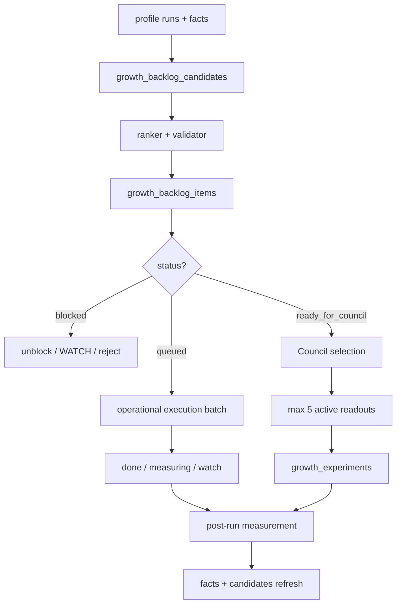

# Growth Mass Execution Vs Experiments

Status: operating runbook for Epic #310 / SPEC #337  
Tenant: ColombiaTours (`colombiatours.travel`)  
Website id: `894545b7-73ca-4dae-b76a-da5b6a3f8441`  
Created: 2026-04-30  
Related: [SPEC_GROWTH_OS_UNIFIED_BACKLOG_AND_PROFILE_RUN_LEDGER](../specs/SPEC_GROWTH_OS_UNIFIED_BACKLOG_AND_PROFILE_RUN_LEDGER.md), [SPEC_GROWTH_OS_MAX_PERFORMANCE_MATRIX](../specs/SPEC_GROWTH_OS_MAX_PERFORMANCE_MATRIX.md), [growth-data-automation-cadence](./growth-data-automation-cadence.md)

## Purpose

Define how Growth OS executes a large backlog quickly without confusing
operational throughput with experiment governance.

The operating decision is:

```text
Many backlog items can be executed in one operational batch.
Only a few independent readouts become active Council experiments.
```

This matters when `growth_backlog_items` contains dozens or hundreds of items.
For example, a one-day push can resolve all technical fixes and content updates,
but Council should still approve at most five active measurable experiments or
readouts.

## Core Rule

| Work category                        |        Can execute in bulk? | Needs Council before execution? |            Counts as active experiment? | Primary validation                   |
| ------------------------------------ | --------------------------: | ------------------------------: | --------------------------------------: | ------------------------------------ |
| Valid technical remediation          |                         Yes |                              No | Only if Council selects it as a readout | Smoke, recrawl, diff                 |
| Sitemap/canonical/404/metadata fixes |                         Yes |                              No |                           No by default | HTTP, sitemap, canonical, DataForSEO |
| Content briefs and content updates   |     Yes, after quality gate |    Only when used as experiment |                      Only selected rows | GSC/GA4, quality review              |
| CRO/activation changes               | Yes, with measurement guard |    Usually yes for active tests |                               Often yes | GA4, funnel events, CRM              |
| Growth opportunities                 |            No, first refine |                Yes if strategic |                             If approved | Council packet                       |
| Blocked items                        |                          No |                              No |                                      No | Unblock, WATCH or reject             |

Council owns experiments. Delivery owners own operational execution.

## Current Backlog Shape Example

At the time this runbook was created, ColombiaTours had:

| Segment               | Ready for Council | Queued | Blocked |   Total |
| --------------------- | ----------------: | -----: | ------: | ------: |
| Technical remediation |                 1 |     19 |       3 |      23 |
| SEO/content           |                 5 |     15 |       5 |      25 |
| CRO/activation        |                11 |     11 |      12 |      34 |
| Growth opportunities  |                 2 |     18 |       0 |      20 |
| **Total**             |            **19** | **63** |  **20** | **102** |

Interpretation:

- the `63 queued` rows are execution backlog;
- the `20 blocked` rows are cleanup/governance backlog;
- the `19 ready_for_council` rows are candidates for at most five active
  readouts;
- the full set can move operationally, but only selected independent rows move
  into `growth_experiments`.

## Data Flow



## One-Day Mass Execution Flow

Use this flow when the team has enough capacity to resolve the full backlog in a
single day or short sprint.

### 1. Freeze Baseline

Before changing production behavior, capture:

- `growth_backlog_items` snapshot by `status`, `work_type` and
  `independence_key`;
- latest GSC completed 28-day window;
- latest GA4 completed 28-day window;
- latest DataForSEO crawl task and diff;
- tracking/funnel freshness;
- Council packet before execution.

Record the baseline artifact or run id in the owner issue, usually #310/#311/#321
and the affected child issue.

Generate the operational packet:

```bash
node scripts/growth/prepare-growth-mass-execution-packet.mjs
```

The packet writes:

- `growth-mass-execution-packet.md`;
- `growth-mass-execution-packet.json`;
- `blocked-cleanup.csv`;
- `queued-operational-batches.csv`;
- `ready-for-council-readouts.csv`;
- `proposed-five-readouts.csv`.

### 2. Split The Backlog

Treat the backlog by state first:

| Status              | Action                                                                                                             |
| ------------------- | ------------------------------------------------------------------------------------------------------------------ |
| `blocked`           | Resolve missing data, owner, source ref, quality gate or dependency. If not actionable, set `watch` or `rejected`. |
| `queued`            | Execute in operational batches. These rows do not need Council unless they change measurement strategy.            |
| `ready_for_council` | Present to Council. Council selects at most five independent active readouts.                                      |

Then split by work type:

| Work type                                                          | Execution lane                                                                                                |
| ------------------------------------------------------------------ | ------------------------------------------------------------------------------------------------------------- |
| `technical_remediation`                                            | Fix-all technical batch: status/soft-404, sitemap, canonical, metadata/H1, internal links, media/performance. |
| `seo_demand`, `content_opportunity`, `serp_competitor_opportunity` | Brief/content batch with quality and locale gates.                                                            |
| `cro_activation`, `tracking_attribution`                           | CRO/tracking batch with funnel smoke and measurement guard.                                                   |
| `growth_opportunity`                                               | Refine into a concrete work type or reject as too generic.                                                    |

### 3. Execute In Separate Batches

Prefer separate commits, owner notes or artifacts per batch:

1. Technical fixes.
2. SEO/content updates.
3. CRO/activation updates.
4. Tracking/governance fixes.
5. Backlog cleanup and rejected/WATCH rows.

Do not hide unrelated changes inside one massive commit if the work touches
different owners or validation gates.

### 4. Run Immediate QA

Minimum checks:

- sitemap and robots smoke;
- HTTP status and no soft-404 for priority URLs;
- canonical and hreflang smoke;
- metadata/H1 smoke for changed templates or pages;
- public CTA and WAFlow smoke;
- GA4/public analytics smoke where applicable;
- tracking/funnel smoke for conversion changes;
- `generate-growth-council-packet.mjs` after backlog status changes.

If QA fails, the affected rows stay `blocked` or `watch`; they do not move to
experiments.

### 5. Update Backlog State

Use consistent state transitions:

| Result                                       | Backlog status                       |
| -------------------------------------------- | ------------------------------------ |
| Change shipped and validated by immediate QA | `done` or `done_pending_measurement` |
| Change shipped but needs data window         | `measuring`                          |
| Dependency unresolved                        | `blocked`                            |
| Evidence inconclusive or low priority        | `watch`                              |
| Not actionable, duplicate or invalid         | `rejected`                           |
| Strong candidate for causal readout          | `ready_for_council`                  |

For tables that do not yet accept every final state, preserve the intended
state in `evidence` and use the closest supported status.

### 6. Council Selects Readouts

Council does not approve all executed work. It selects the few readouts that the
team will interpret as experiments.

Default cap:

- maximum five active experiments/readouts;
- each must have source row, baseline, owner, success metric, evaluation date
  and independence key;
- no active independence collisions unless Council records an explicit
  exception.

Recommended readout packs after a one-day execution:

1. Technical remediation batch.
2. SEO/content batch.
3. CRO/CTA batch.
4. Locale/EN quality batch.
5. Market or SERP demand batch.

### 7. Measure By Window

| Signal                    | Earliest useful readout |         Final readout |
| ------------------------- | ----------------------: | --------------------: |
| Technical smoke           |                Same day |              Same day |
| Tracking/funnel smoke     |                Same day |              1-3 days |
| DataForSEO recrawl/diff   | 24-48 hours after fixes | Next comparable crawl |
| GA4 engagement/activation |                3-7 days |            14-28 days |
| GSC clicks/CTR/position   |                 14 days |               28 days |
| Content ranking impact    |              14-28 days |            45-90 days |

## What Not To Do

- Do not create 102 experiments from 102 backlog items.
- Do not block valid technical fixes waiting for Council.
- Do not publish EN/localized content without quality gate just because it is
  queued.
- Do not compare GSC/GA4 windows that were not completed or aligned.
- Do not let a deterministic script activate experiments.
- Do not treat `done` as successful growth impact until the measurement window
  is read.

## Acceptance Criteria

A mass execution sprint is correctly managed when:

- every backlog item ends in `done`, `measuring`, `queued`, `watch`, `blocked`
  or `rejected`;
- technical remediation was validated by smoke and, where relevant, DataForSEO
  recrawl/diff;
- content updates passed quality and locale gates;
- CRO/tracking changes passed funnel smoke;
- Council has at most five active readouts;
- rejected or blocked rows include a concrete reason;
- #310/#311/#321 and relevant child issues link the artifacts.
