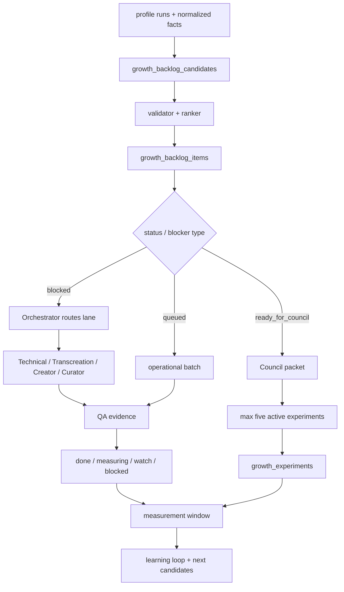

# SPEC: Growth OS Agent Lanes

Status: Accepted operating layer for EPIC #310 / SPEC #337
Tenant: ColombiaTours (`colombiatours.travel`)
Website id: `894545b7-73ca-4dae-b76a-da5b6a3f8441`
Created: 2026-05-01
Owner: Growth OS Orchestrator + Council
Canonical execution: [#310](https://github.com/weppa-cloud/bukeer-studio/issues/310)
Related SPECs: [SPEC_GROWTH_OS_SSOT_MODEL](./SPEC_GROWTH_OS_SSOT_MODEL.md), [SPEC_GROWTH_OS_UNIFIED_BACKLOG_AND_PROFILE_RUN_LEDGER](./SPEC_GROWTH_OS_UNIFIED_BACKLOG_AND_PROFILE_RUN_LEDGER.md), [SPEC_GROWTH_OS_MAX_PERFORMANCE_MATRIX](./SPEC_GROWTH_OS_MAX_PERFORMANCE_MATRIX.md)

## Purpose

Define the first executable agent model for Growth OS. The system uses agents to
route blocked work, execute high-confidence operational batches and prepare
Council decisions without turning GitHub issues into the live Growth backlog.

Official rule:

```text
profile runs -> facts -> candidates -> reviewed backlog items
  -> agent lane -> task or experiment -> QA -> measured result -> learning loop
```

GitHub / #310 remains the implementation SSOT. Supabase / Bukeer Studio remains
the operational Growth SSOT.

## Agent Lanes V1

The approved v1 model uses five core lanes. DataForSEO, GSC, GA4, tracking,
browser and Playwright are shared tools, not independent agents.

| Lane                                     | Primary purpose                                                                        | Inputs                                                                           | Writes                                                               | Owner issues                |
| ---------------------------------------- | -------------------------------------------------------------------------------------- | -------------------------------------------------------------------------------- | -------------------------------------------------------------------- | --------------------------- |
| Growth Orchestrator / Blocked Router     | Classify blocked work, assign lanes, enforce SSOT, publish evidence.                   | `growth_backlog_items`, health reports, profile runs, issue gates.               | status/routing metadata, cycle summaries, GitHub aggregate comments. | #310, #311, #321, #397-#399 |
| Technical Remediation Agent              | Resolve technical SEO and public-renderer blockers.                                    | DataForSEO OnPage facts, `seo_audit_findings`, sitemap/canonical/hreflang smoke. | technical tasks, remediation evidence, #313 cohorts.                 | #312, #313                  |
| Transcreation Growth Agent               | Manage locale expansion as transcreation, not literal translation.                     | GSC/GA4 market facts, SERP intent, `seo_transcreation_jobs`, quality checks.     | transcreation jobs, quality findings, locale backlog status.         | #314, #315, #316, #367      |
| Content Creator Agent                    | Generate briefs, content updates and new content candidates with measurable baselines. | GSC/GA4 facts, DataForSEO Labs/SERP/Content Analysis, existing briefs.           | `growth_content_briefs`, draft content tasks, source refs.           | #314-#320, #368, #369       |
| Content Curator + Council Operator Agent | Review content quality, promote backlog, prepare Council and enforce experiment rules. | briefs, tasks, backlog items, experiments, QA results.                           | review decisions, Council packets, experiment status.                | #321, #311, #399            |

## Project Preferences And 2026 Content Standard

All agent output must reflect real ColombiaTours project preferences and current
2026 search/content governance. Agents should not generate generic SEO copy,
thin scaled pages or literal translations.

Project preference inputs:

- ColombiaTours audience, markets, offers, tone, CTA model and trust proof.
- Existing Studio content, published URLs, canonical locale policy and
  conversion path.
- GSC/GA4 demand, activation and market/device signals.
- DataForSEO Labs/SERP/Content Analysis competitor evidence.
- Human/Council decisions captured in reviews, backlog status and issue gates.

Content governance sources:

- [Google Search Central: creating helpful, reliable, people-first content](https://developers.google.com/search/docs/fundamentals/creating-helpful-content)
- [Google Search Central: guidance about generative AI content](https://developers.google.com/search/docs/fundamentals/using-gen-ai-content)
- [Google Search Central: spam policies](https://developers.google.com/search/docs/essentials/spam-policies)

Minimum standard:

| Standard             | Requirement                                                                                                                                                    |
| -------------------- | -------------------------------------------------------------------------------------------------------------------------------------------------------------- |
| People-first purpose | Content exists to help a defined traveler/market complete a decision, not only to capture rankings.                                                            |
| E-E-A-T              | Output must show experience, expertise, authoritativeness and trust through concrete travel knowledge, proof, author/reviewer signals or operational evidence. |
| Who / How / Why      | Curator must be able to explain who created/reviewed the content, how sources/AI/tools were used, and why the page should exist.                               |
| Original value       | Content must add local expertise, itinerary insight, comparison, planning detail, pricing/seasonality context or trust proof beyond SERP summaries.            |
| Anti-scaled-abuse    | Bulk creation is allowed only when each page has differentiated value, source evidence and review. Thin templated pages remain blocked.                        |
| AI transparency      | AI-assisted drafts are permitted, but must be reviewed; AI must not fabricate facts, replace source evidence or self-approve.                                  |

## Competitive Content Bar

Creator and Curator must use competitor evidence to produce content that is
materially better than the pages currently winning the SERP.

Required competitive checks for briefs and updates:

| Check               | Data source                             | Passing bar                                                                               |
| ------------------- | --------------------------------------- | ----------------------------------------------------------------------------------------- |
| SERP intent         | DataForSEO SERP + GSC query/page        | Page matches the dominant intent and identifies missed sub-intents.                       |
| Competitor coverage | DataForSEO SERP/Labs/Content Analysis   | Brief lists what top competitors cover and what ColombiaTours will add.                   |
| Differentiation     | Studio inventory + ColombiaTours proof  | Content includes proprietary/local insight, itinerary detail, CTA fit or trust proof.     |
| Snippet opportunity | SERP features, PAA, title/meta patterns | Proposed title/meta/H1/FAQ/schema target a concrete SERP feature or CTR gap.              |
| Conversion fit      | GA4/funnel/CTA evidence                 | Page has a clear next step aligned with WAFlow/CRM/itinerary confirmation.                |
| Quality risk        | Curator review                          | No factual gaps, weak translation, duplicate copy, locale mismatch or unsupported claims. |

A content task cannot move to `ready_for_seo_qa`, `ready_for_council` or
`active` experiment status unless Curator records the competitive advantage or
explicitly blocks it as `content_quality`.

## Lane Contracts

### Growth Orchestrator / Blocked Router

- Classifies `blocked` items into `locale_gate_required`,
  `technical_or_route_mapping`, `provider_or_access`, `content_quality`,
  `experiment_readiness`, `tracking_or_attribution` or `needs_manual_review`.
- Assigns one lane and one next action per blocked item.
- Can mark rows `watch`, `rejected`, `queued` or keep `blocked` when evidence is
  incomplete.
- Publishes only aggregate GitHub evidence: counts, decisions, artifact links
  and owner issues.

### Technical Remediation Agent

- Handles soft-404, HTTP status, redirects, sitemap, canonical, hreflang,
  metadata/H1, internal links, media assets and repeatable performance patterns.
- Uses DataForSEO OnPage and browser/Playwright smoke before marking work done.
- Does not publish or translate content. If content is missing or low quality,
  routes the item to Transcreation or Content.
- Required evidence: affected URL, before/after status, canonical result,
  sitemap/hreflang impact and recrawl/diff when available.

### Transcreation Growth Agent

- Treats EN-US, Mexico and future locales as business transcreation. It must
  preserve facts, adapt market intent and validate SEO surface quality.
- Uses real project preferences: market vocabulary, ColombiaTours trust proof,
  offer fit, CTA behavior and locale-specific traveler objections.
- Re-researches target-market SERPs instead of translating Spanish keywords
  literally.
- Uses `seo_transcreation_jobs`, `seo_translation_quality_checks`,
  `seo_translation_qa_findings` and `seo_localized_variants`.
- Blocks publish/sitemap/hreflang when quality is `blocked` or when the target
  locale redirects to default-locale content.
- Required evidence: source URL, target locale, grade/status, risks, reviewer,
  market intent and publish decision.

### Content Creator Agent

- Creates briefs and content updates from reviewed backlog items, not directly
  from raw provider payloads.
- Must include source refs, baseline, intent, SERP observations, primary CTA,
  success metric and evaluation window.
- Must include a competitive content plan: top competing patterns, content gap,
  ColombiaTours added value and expected SERP/activation advantage.
- Must follow people-first and anti-scaled-abuse rules; volume does not justify
  thin, duplicated or undifferentiated pages.
- Can draft content tasks but cannot approve its own work for apply/publish.
- Required evidence: source profiles, source facts, hypothesis, target keyword
  or cluster, proposed update and owner issue.

### Content Curator + Council Operator Agent

- Reviews Creator output for SEO, factual accuracy, brand, locale, canonical,
  CTA and measurement readiness.
- Reviews competitive superiority: the page must be more useful than competing
  pages for the target intent, or it remains blocked/watch.
- Validates Who/How/Why, E-E-A-T, AI-assisted creation disclosure needs and
  scaled-content risk before publish or Council promotion.
- Promotes backlog items to Council only when source row, baseline, owner,
  success metric, evaluation date and independence key are present.
- Enforces the default cap of five active experiments/readouts. Operational
  batches can be executed in bulk without becoming experiments.
- Required evidence: review decision, reasons, accepted/rejected risks,
  experiment status and Council packet artifact.

## Tool And Permission Matrix

| Tool/source                           | Orchestrator                | Technical                          | Transcreation                     | Creator                           | Curator/Council           |
| ------------------------------------- | --------------------------- | ---------------------------------- | --------------------------------- | --------------------------------- | ------------------------- |
| Supabase operational tables           | read/write routing metadata | read/write technical task evidence | read/write locale jobs/checks     | write briefs/tasks                | write reviews/experiments |
| GitHub issues                         | aggregate comments only     | issue evidence for #313            | issue evidence for #314/#315/#367 | issue evidence for content issues | Council decisions         |
| DataForSEO OnPage                     | health/context              | primary source                     | locale technical context          | context only                      | validation context        |
| DataForSEO Labs/SERP/Content Analysis | context                     | SERP tech context                  | market/intent source              | primary source                    | validation source         |
| GSC/GA4 facts                         | freshness/context           | traffic impact                     | locale demand/activation          | baseline/source                   | baseline enforcement      |
| Browser/Playwright                    | smoke verification          | primary smoke                      | locale smoke                      | preview checks                    | final QA                  |
| Paid/Tracking facts                   | routing/context             | CTA smoke context                  | usually none                      | CTA baseline                      | experiment readiness      |

No lane may store provider secrets, raw PII or raw provider payloads in GitHub
comments. Raw/cache and detailed operational rows belong in Supabase or
artifacts.

## Status Routing

| Blocker type                 | Default lane                      | Valid next statuses                                                   |
| ---------------------------- | --------------------------------- | --------------------------------------------------------------------- |
| `locale_gate_required`       | Transcreation Growth Agent        | `queued`, `watch`, `blocked`, `rejected`                              |
| `technical_or_route_mapping` | Technical Remediation Agent       | `queued`, `done`, `watch`, `blocked`                                  |
| `provider_or_access`         | Growth Orchestrator               | `watch`, `blocked`, `rejected`                                        |
| `content_quality`            | Creator -> Curator                | `ready_for_brief`, `brief_in_progress`, `ready_for_seo_qa`, `blocked` |
| `experiment_readiness`       | Curator + Council Operator        | `ready_for_council`, `approved`, `active`, `paused`, `rejected`       |
| `tracking_or_attribution`    | Orchestrator -> Technical/Council | `queued`, `watch`, `blocked`, `ready_for_council`                     |

## Operating Flow



## Acceptance Criteria

- Every blocked item can be routed to exactly one lane or explicitly marked
  `needs_manual_review`.
- Creator cannot approve its own content; Curator or Council must review before
  apply/publish or active experiment status.
- Creator/Curator must record competitive content advantage before content can
  become `ready_for_seo_qa`, `ready_for_council` or an active experiment.
- Transcreation must preserve project preferences and target-market intent, not
  literal translation.
- AI-assisted or bulk content must pass people-first, original-value and
  anti-scaled-abuse checks before publishing.
- Technical fixes can be executed in bulk without consuming experiment slots.
- Locale work cannot enter sitemap/hreflang unless Transcreation quality gate
  passes or Council records an explicit exception.
- Council packet contains no active experiment without source row, baseline,
  owner, success metric, evaluation date and independence key.
- GitHub comments stay aggregated and link to artifacts or operational table
  counts instead of storing full backlog rows.

## Implementation Backlog

| Priority | Task                                                                                                                                         | Owner issue    |
| -------- | -------------------------------------------------------------------------------------------------------------------------------------------- | -------------- |
| P0       | Extend blocked classifier to emit `agent_lane`, `blocker_type` and next action for backlog items and content tasks.                          | #311/#397/#398 |
| P0       | Update Council packet to group rows by agent lane and reject rows without required experiment fields.                                        | #321/#399      |
| P0       | Add Transcreation lane reporting to EN quality artifacts and #314/#315/#367.                                                                 | #314/#315/#367 |
| P0       | Add Creator/Curator content quality fields: project preferences used, competitor gap, added value, E-E-A-T evidence and scaled-content risk. | #314-#320/#398 |
| P1       | Add Bukeer Studio UI filters for lane, blocker type, next action and review state.                                                           | #311           |
| P1       | Create dedicated executable Codex skills for the five lanes after the lane contracts stabilize.                                              | #310           |
| P2       | Add agent performance metrics: cycle time, unblock rate, QA pass rate and experiment readout quality.                                        | #321           |
