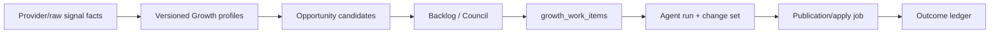

# SPEC: Growth OS Paperclip Autonomous CEO Cockpit

## GitHub Tracking

- **Epic Issue**: [#431](https://github.com/weppa-cloud/bukeer-studio/issues/431)
- **Child Issues**: [#432](https://github.com/weppa-cloud/bukeer-studio/issues/432), [#433](https://github.com/weppa-cloud/bukeer-studio/issues/433), [#434](https://github.com/weppa-cloud/bukeer-studio/issues/434), [#435](https://github.com/weppa-cloud/bukeer-studio/issues/435), [#436](https://github.com/weppa-cloud/bukeer-studio/issues/436), [#437](https://github.com/weppa-cloud/bukeer-studio/issues/437), [#438](https://github.com/weppa-cloud/bukeer-studio/issues/438), [#439](https://github.com/weppa-cloud/bukeer-studio/issues/439)
- **Milestone**: ColombiaTours Growth OS 90D / Q2 2026
- **Area**: studio + runtime + contract + supabase + growth

## Status

- **Author**: Codex + Growth OS Orchestrator
- **Date**: 2026-05-07
- **Status**: Reviewed / ready for GitHub execution
- **ADRs referenced**: ADR-003, ADR-005, ADR-008, ADR-009, ADR-018, ADR-029
- **Cross-repo impact**: Supabase shared schema must be traced through `bukeer-flutter`; Flutter may later read `growth_work_item_outcomes` and `funnel_events` for CRM dashboards, but v1 writes are Studio/runtime service-role only.

## Summary

Build a Paperclip-style CEO cockpit for Growth OS inside Bukeer Studio. For ColombiaTours v1, Growth OS acts as a visible company of autonomous growth agents focused on organic growth, reversible technical remediation and funnel measurement: agents can move from opportunity to organic publication or technical apply without prior human approval only when policy, caps, smoke checks, rollback and measurement contracts pass.

## Relationship To Epic #310

This SPEC is a sub-epic and amendment to [#310](https://github.com/weppa-cloud/bukeer-studio/issues/310), not a parallel Growth OS. #310 remains the parent operating system for North Star, AARRR, Growth Council, provider facts, attribution, paid governance and reporting.

Conflict resolution against the current #310 guardrails:

- #310's generic runtime rule remains valid: `content_publish`, `transcreation_merge`, `paid_mutation` and `experiment_activation` are blocked from generic agent automation.
- #431 introduces a narrower dedicated-adapter exception: ColombiaTours organic publication and reversible technical remediation may execute without prior human approval only through server-side publisher/technical adapters with tenant allowlist, policy, caps, smoke, rollback and outcome measurement.
- `paid_mutation` and `experiment_activation` remain always blocked in v1. No policy row can unlock them.
- `growth_work_items` becomes the runtime execution queue only; #310 backlog, inventory and Council ledgers remain the operational Growth SSOT.
- The CEO cockpit evolves #310's Growth overview/control plane; it must not create a second Growth UI or duplicate #405/#406/#407 surfaces.
- Shared Supabase migrations must be applied or traced according to [[supabase-migration-governance]] before production rollout.

## Motivation

The current Growth OS runtime already has agents, runs, change sets, memories, skills, tool ledgers and a Workboard, but it is still primarily a human-review control plane. The CEO needs one operating surface that answers:

1. What business objective is Growth OS pursuing?
2. Which agents are working, blocked or producing output?
3. What did the system publish or apply autonomously?
4. Which work is tied to leads, bookings, organic clicks or experiments?
5. What risk, budget, smoke or attribution issue needs intervention?

This SPEC upgrades Growth OS from a review queue into a Paperclip-like growth company control plane while preserving tenant isolation, rollback, auditability and paid-media safety.

## Product Decisions

| Decision | Rule |
| --- | --- |
| Rollout tenant | ColombiaTours only for v1. |
| UI owner | Founder/CEO first; Growth operator and Curator remain secondary workflows. |
| First impact surface | Organic growth + technical remediation + funnel attribution. Paid media remains read-only in v1. |
| Autonomy stance | Aggressive for organic publication and reversible technical apply only through dedicated adapters: no prior human approval when all gates pass. |
| Caps | Medium caps: weekly limits by lane/action plus alerting and automatic pause when exceeded. |
| Public mutation | Blocked from generic runtime; allowed only through dedicated publisher/technical adapters that snapshot, apply, smoke, log and prepare rollback. |
| Paid mutation | Always blocked in v1, even if a policy row is misconfigured. |

## Current-State Delta

Existing tables and UI remain valid:

- `growth_agent_definitions`, `growth_agent_runs`, `growth_agent_run_events`
- `growth_agent_change_sets`
- `growth_work_items`
- `growth_agent_memories`, `growth_agent_skills`, `growth_agent_tool_calls`, `growth_agent_replay_cases`, `growth_agent_run_metrics`
- `/dashboard/[websiteId]/growth/overview`, `/agents`, `/workboard`, `/runs`

Required changes:

- `growth_work_items` becomes the primary runtime claim queue for new autonomous work. Backlog rows, content tasks, runs and change sets project into work items, while #310 backlog/inventory/Council tables remain the operational planning SSOT.
- The runtime stops forcing every result into `review_required` when a tenant policy explicitly enables organic or technical autonomy.
- Always-gated paid and experiment actions stay blocked.
- RLS policies on new Growth tables, and any touched legacy Growth runtime tables, must use `user_roles` tenant membership instead of `account_id = auth.uid()`.

## User Flows

### Flow 1: CEO Opens Growth OS

1. Founder opens `/dashboard/[websiteId]/growth/overview`.
2. Studio shows the CEO cockpit with North Star, outcome, agent company status, autonomy feed, impact ledger and risk/budget panel.
3. Founder sees whether Growth OS is producing qualified trip requests, attributed bookings, organic clicks and measurable work.
4. Founder can drill into a work item, publication job, agent or risk without leaving the Growth OS console.

### Flow 2: Autonomous Organic Publication

1. Orchestrator claims a ready `growth_work_items` row for ColombiaTours.
2. Agent produces a valid change set with target entity, before/after payload, baseline, success metric and evaluation date.
3. Autonomy gate checks tenant policy, action class, lane, caps, required checks, risk score, rollback availability and paid-media exclusion.
4. Publisher adapter snapshots the target, applies the organic change, runs smoke checks and writes a `growth_publication_jobs` row.
5. On smoke pass, the work item becomes `published_applied` and a `growth_work_item_outcomes` row enters `measuring`.
6. On smoke fail, the adapter rolls back, marks the publication job `rolled_back`, and moves the work item to `blocked` with evidence.

### Flow 3: Autonomous Technical Remediation

1. Orchestrator claims a technical remediation `growth_work_items` row for ColombiaTours.
2. Agent produces a valid change set with `action_class='safe_apply'`, target entity, before/after payload, baseline, success metric, evaluation date and rollback payload.
3. Autonomy gate checks tenant policy, technical lane, caps, risk score, required smoke checks and reversibility.
4. Technical adapter snapshots the target, applies the reversible fix, runs immediate smoke and writes a `growth_publication_jobs` row with status `applied`.
5. On smoke pass, the work item becomes `published_applied` and a `growth_work_item_outcomes` row enters `measuring`.
6. On smoke fail, the adapter rolls back, marks the job `rolled_back`, and blocks the work item with failure evidence.

### Flow 4: Kill Switch Or Lane Pause

1. CEO or authorized admin toggles the autonomy kill switch or pauses one lane.
2. Runtime can finish already-started safe steps but cannot claim new publish-capable work for the paused scope.
3. Cockpit reflects the paused state, affected lane, reason and latest blocked work.

### Flow 5: Outcome Evaluation

1. Evaluation date arrives for an autonomous publication.
2. Runtime or operator refreshes outcome metrics from GSC, GA4 and `funnel_events`.
3. `growth_work_item_outcomes` is marked `win`, `loss`, `inconclusive`, `scale` or `stop`.
4. Approved learning candidates may become memories/skills, but only through the existing learning approval flow unless a later SPEC changes that gate.

## Acceptance Criteria

- [ ] AC1: CEO cockpit shows business objective, North Star, outcome, agent company, autonomy feed, impact ledger, budget/risk and kill switch state on the Growth overview page.
- [ ] AC2: New autonomous work is claimable from `growth_work_items`; legacy backlog/content/change-set rows remain readable but do not become a second primary runtime queue.
- [ ] AC3: Every autonomous publication has `work_item_id`, `change_set_id`, before snapshot, after payload, smoke result, rollback payload and linked outcome row.
- [ ] AC4: `content_publish` and `transcreation_merge` may auto-execute only for ColombiaTours organic work when policy, caps, smoke and rollback pass.
- [ ] AC4b: `safe_apply` may auto-execute only for ColombiaTours technical remediation work when the change is reversible, low/medium capped risk, smoke-verifiable and rollbackable.
- [ ] AC5: `paid_mutation` and campaign budget edits are blocked in all v1 paths, regardless of policy configuration.
- [ ] AC6: No autonomous publication can proceed without `success_metric` and `evaluation_date`.
- [ ] AC7: Failed smoke triggers rollback and marks the publication job `rolled_back` with failure class and evidence.
- [ ] AC8: Weekly caps pause the relevant lane/action class and surface the pause in the CEO cockpit.
- [ ] AC9: RLS for new tables uses `user_roles` membership and denies cross-tenant reads.
- [ ] AC10: All runtime mutations are service-role/server-side only; browser clients never write Growth runtime tables directly.

## Data Model Changes

### `growth_autonomy_policies`

Tenant/lane/action policy that decides whether autonomous organic publication or technical apply is allowed.

| Column | Type | Notes |
| --- | --- | --- |
| `id` | uuid PK | default `gen_random_uuid()` |
| `account_id` | uuid | Tenant scope. |
| `website_id` | uuid | Website scope. |
| `lane` | text | One canonical agent lane. |
| `action_class` | text | `content_publish`, `transcreation_merge`, `safe_apply`, etc. |
| `enabled` | boolean | Enables this policy row. |
| `kill_switch_enabled` | boolean | When true, blocks all claims for this policy. |
| `paused_reason` | text nullable | Operator/runtime pause explanation. |
| `max_risk_score` | integer | 0-100. |
| `daily_cap` | integer nullable | Optional daily publication cap. |
| `weekly_cap` | integer nullable | Medium-cap v1 default. |
| `required_checks` | text[] | e.g. `snapshot`, `smoke`, `rollback`, `measurement`, `funnel_attribution`. |
| `allowed_target_tables` | text[] | v1: `website_blog_posts`, `website_pages`, `website_sections`, transcreation target tables. |
| `created_at`, `updated_at` | timestamptz | Standard timestamps. |

Unique key: `(account_id, website_id, lane, action_class)`.

### `growth_publication_jobs`

Append-only publication/apply ledger for autonomous organic and reversible technical changes.

| Column | Type | Notes |
| --- | --- | --- |
| `id` | uuid PK | default `gen_random_uuid()` |
| `account_id`, `website_id` | uuid | Tenant scope. |
| `work_item_id` | uuid FK | Required. |
| `change_set_id` | uuid FK | Required. |
| `run_id` | uuid nullable | Linked agent run. |
| `action_class` | text | Must not be `paid_mutation` in v1. |
| `target_table` | text | Adapter target. |
| `target_id` | text nullable | Existing row id, nullable for create-before-insert jobs. |
| `target_locator` | jsonb | Slug/locale/path metadata. |
| `before_snapshot` | jsonb | Required. |
| `after_payload` | jsonb | Required. |
| `rollback_payload` | jsonb | Required. |
| `smoke_result` | jsonb | Required before terminal state. |
| `status` | text | `queued`, `applying`, `smoke_failed`, `published`, `applied`, `rolled_back`, `blocked`. |
| `failure_class` | text nullable | Smoke/apply/rollback failure. |
| `published_at`, `rolled_back_at` | timestamptz nullable | Terminal timestamps. |
| `created_at`, `updated_at` | timestamptz | Standard timestamps. |

### `growth_work_item_outcomes`

Measurement ledger for autonomous work.

| Column | Type | Notes |
| --- | --- | --- |
| `id` | uuid PK | default `gen_random_uuid()` |
| `account_id`, `website_id` | uuid | Tenant scope. |
| `work_item_id` | uuid FK | Required. |
| `publication_job_id` | uuid FK nullable | Required for published work. |
| `baseline` | jsonb | Required. |
| `success_metric` | text | Required. |
| `evaluation_date` | date | Required. |
| `measurement_window` | text | `day_1`, `day_7`, `day_21`, `day_28`, `day_30`, `day_45`. |
| `current_result` | text | `measuring`, `win`, `loss`, `inconclusive`, `scale`, `stop`. |
| `funnel_attribution_status` | text | `valid`, `partial`, `missing`, `not_applicable`. |
| `metric_snapshot` | jsonb | Latest GSC/GA4/funnel readout. |
| `learning_candidate_id` | uuid nullable | Optional link to memory/skill/replay candidate. |
| `created_at`, `updated_at` | timestamptz | Standard timestamps. |

Migration path: forward-only. Seed ColombiaTours policies disabled by default unless `GROWTH_OS_AGGRESSIVE_AUTONOMY_ENABLED=true` and the policy row is enabled.

## API / Contract Changes

| Endpoint/RPC/Schema | Method | Payload | Notes |
| --- | --- | --- | --- |
| `GrowthAutonomyPolicySchema` | Zod | table row/input | In `@bukeer/website-contract`. |
| `GrowthPublicationJobSchema` | Zod | table row/input | Enforces snapshot/rollback/smoke requirements. |
| `GrowthWorkItemOutcomeSchema` | Zod | table row/input | Enforces success metric and evaluation date. |
| `getGrowthCeoCockpit(accountId, websiteId)` | server query | args | Aggregates North Star, outcome, agent company, autonomy feed and risk/budget. |
| `getGrowthAutonomyHealth(accountId, websiteId)` | server query | args | Policies, caps, kill switch, paused lanes, smoke failures. |
| `getGrowthImpactLedger(accountId, websiteId)` | server query | args | Work item -> publication -> outcome chain. |
| `toggleGrowthAutonomyPolicy` | server action | policy id + state | Admin/founder only. |
| `rollbackGrowthPublicationJob` | server action | publication job id | Admin/founder only; calls adapter rollback. |
| `markGrowthOutcomeEvaluated` | server action | outcome id + result | Admin/growth operator only. |

## Publisher Adapters

Adapters are runtime/server modules, not browser code.

| Adapter | Target | Allowed v1 mutation |
| --- | --- | --- |
| Blog publisher | `website_blog_posts` | Create or update organic blog posts; set published only after smoke. |
| Page publisher | `website_pages` | Create or update organic landing/static pages. |
| Section publisher | `website_sections` | Update bounded section copy/content. |
| Transcreation publisher | existing transcreation workflow | Merge localized content only when translation quality and target-market gates pass. |
| Technical SEO adapter | `website_pages`, `website_blog_posts`, `website_sections` | Apply reversible metadata, indexability, structured-content or internal-link data fixes with smoke/rollback. |

Each adapter must implement:

1. `snapshot(target)`
2. `validatePayload(afterPayload)`
3. `apply(afterPayload)`
4. `smoke(target)`
5. `rollback(rollbackPayload)`
6. `recordPublicationJob(result)`

Adapters must not touch pricing, availability, reservations, payments, CRM request state or paid campaigns. Technical autonomy is limited to reversible data/configuration changes that can be snapshotted and smoked; destructive technical changes, schema migrations and code deploys remain outside v1 autonomy.

## Permissions (RBAC)

| Role | View cockpit | Toggle autonomy | Pause lane | Rollback job | Evaluate outcome |
| --- | --- | --- | --- | --- | --- |
| `viewer` | yes | no | no | no | no |
| `growth_operator` | yes | no | yes | no | yes |
| `curator` | yes | no | yes | yes | yes |
| `council_admin` | yes | yes | yes | yes | yes |
| `super_admin` | yes | yes | yes | yes | yes |
| `service_role` | all | all | all | all | all |

RLS rule: authenticated reads require active `user_roles` membership for `account_id`; writes are service-role only for runtime tables.

## Sprint 1 Addendum: Signal -> Profile -> Candidate -> Work Item

Growth OS must not invent backlog directly from an agent prompt. The orchestrator promotes work only from traceable signals, fresh profiles and scored opportunity candidates.

### Data Flow

### Profile Cadence

| Profile | Primary sources | Refresh rule | Blocks autonomy when |
| --- | --- | --- | --- |
| `business` | CRM, funnel events, account brief | monthly or when offer/ICP changes | confidence < 0.75 or expired |
| `buyer` | CRM, Chatwoot, GA4, form events | monthly, plus weekly sample refresh | confidence < 0.72 or expired |
| `seo_market` | GSC, DataForSEO, inventory | weekly | confidence < 0.70 or expired |
| `competitor` | DataForSEO SERP, AI/GEO checks | weekly | confidence < 0.65 or expired for transcreation/market bets |
| `page_product` | live website row, crawl, GSC URL facts | immediately before publish/apply, max 1 hour old | missing, stale, or target mismatch |
| `agent_lane` | run metrics, tool ledger, replay cases | daily and after runtime releases | lane confidence drops below policy |
| `risk_policy` | autonomy policy, caps, blocked tool classes | realtime, max 1 hour old | missing, stale, kill switch, cap exceeded |

### Backlog Creation Rule

The orchestrator can create or promote backlog only when all of the following are true:

- a `growth_opportunity_candidates` row has evidence, idempotency key, `success_metric` and `evaluation_window`;
- required profile types pass the freshness gate for the candidate action class;
- candidate score is high enough for `ready_for_backlog` or Council explicitly approves it;
- paid mutation and experiment activation are excluded from autonomous promotion;
- the promoted `growth_work_items` row keeps the candidate id/profile snapshot in metadata.

### New Tables

| Table | Purpose |
| --- | --- |
| `growth_signal_facts` | Append-only normalized facts from GSC, GA4, DataForSEO, CRM, funnel events, audits and manual evidence. |
| `growth_profiles` | Versioned profiles used by agents to reason about business, buyer, market, page/product, lane and risk context. |
| `growth_opportunity_candidates` | Scored opportunities that can become backlog/work items only after freshness, evidence and measurement gates pass. |

### Sprint 1 Acceptance Criteria

- [ ] Signal/profile/candidate contracts exist in `@bukeer/website-contract`.
- [ ] Supabase tables have service-role writes and tenant-scoped authenticated reads through `user_roles`.
- [ ] Freshness gate blocks stale, missing or low-confidence profiles before backlog promotion.
- [ ] CEO cockpit surfaces profile freshness and opportunity candidate health.
- [ ] E2E verifies the CEO can see the data-flow health surface in the Growth cockpit.

## Affected Files / Packages

| Path | Change | Description |
| --- | --- | --- |
| `supabase/migrations/*_growth_paperclip_autonomy.sql` | Create | Add policies, publication jobs, outcomes and RLS fixes. |
| `packages/website-contract/src/schemas/*` | Create/Modify | Add Zod contracts and exports. |
| `runtime/growth-orchestrator/src/*` | Modify | Claim `growth_work_items`, evaluate aggressive organic/technical policies, write publication jobs. |
| `lib/growth/autonomy/*` | Modify/Create | Policy/cap/gate evaluator shared by Studio and runtime. |
| `lib/growth/publisher/*` | Create | Server-side publisher adapters. |
| `lib/growth/console/queries-ceo-cockpit.ts` | Create | CEO cockpit aggregation. |
| `app/dashboard/[websiteId]/growth/overview/page.tsx` | Replace | CEO cockpit UI. |
| `app/dashboard/[websiteId]/growth/*/actions.ts` | Modify/Create | Admin actions for kill switch, pause, rollback and outcomes. |

## Edge Cases & Error Handling

1. Missing policy row -> fail closed; work stays ready/review-needed.
2. Policy enabled but global env disabled -> fail closed and show cockpit warning.
3. `paid_mutation` requested -> block, ledger tool call and mark work item blocked.
4. Missing baseline, success metric or evaluation date -> no publication; create evidence task.
5. Smoke fails after apply -> rollback immediately; if rollback fails, mark `blocked` and page risk as P0.
6. Cap exceeded mid-run -> do not start apply; mark work item ready/paused with cap evidence.
7. Cross-tenant target mismatch -> block before snapshot.
8. Duplicate idempotency key -> reuse existing work item/job; do not double publish.
9. Attribution unavailable -> publication may proceed for SEO-only metrics, but outcome is `funnel_attribution_status='partial'` and cannot be classified as commercial win.
10. Transcreation quality gate missing -> no merge; produce review/change set only.

## Out of Scope

- Automatic paid campaign creation, paid budget changes or experiment activation.
- Autonomous pricing, availability, bookings, payments or CRM state mutation.
- Destructive technical changes, database migrations, code deploys, canonical/hreflang batch deletes or route removals.
- Multi-tenant rollout beyond ColombiaTours.
- Full Paperclip clone with generic org chart/projects/cost center outside Growth OS.
- Automatic activation of memories/skills without the existing review flow.

## Dependencies

- [[SPEC_GROWTH_OS_SSOT_MODEL]]
- [[SPEC_GROWTH_OS_AGENT_LANES]]
- [[SPEC_GROWTH_OS_SYMPHONY_ORCHESTRATOR]]
- [[SPEC_GROWTH_OS_CONTROL_PLANE_UX]]
- [[SPEC_GROWTH_OS_RUNTIME_8_5_HERMES_INSPIRED]]
- [[SPEC_GROWTH_OS_AGENT_CHANGE_SETS_WORK_CENTER]]
- [[SPEC_FUNNEL_EVENTS_SOT]]
- [[growth-attribution-governance]]
- [[growth-translation-quality-gate]]
- [[supabase-migration-governance]]

## Rollout

- Feature flag: `GROWTH_OS_AGGRESSIVE_AUTONOMY_ENABLED=false` by default.
- Tenant allowlist: ColombiaTours website id only in v1.
- Policy rows seeded disabled; enable through admin action after staging smoke.
- Stage order:
  1. Contracts + migrations + RLS.
  2. CEO cockpit read-only aggregation.
  3. Runtime claim from `growth_work_items` without publication.
  4. Publisher adapters in dry-run mode.
  5. ColombiaTours organic + technical autonomy enabled with caps.
  6. Outcome evaluation and learning loop.
- Required runbook: `docs/ops/growth-paperclip-autonomy-runbook.md`.

## Test Plan

- Unit:
  - autonomy gate allows ColombiaTours organic publish and technical safe apply only with enabled policy, caps available, rollback, smoke and measurement fields;
  - paid mutation is always blocked;
  - missing metric/evaluation date blocks publication;
  - destructive or non-rollbackable technical changes are blocked;
  - cap exhaustion pauses lane/action.
- Integration:
  - work item -> run -> change set -> publication job -> smoke pass -> outcome measuring;
  - smoke fail -> rollback -> `rolled_back` publication job -> blocked work item;
  - duplicate idempotency does not double publish.
- E2E:
  - CEO cockpit renders objective, agent company, autonomy feed, impact ledger, budget/risk and kill switch;
  - Workboard shows auto-published and rolled-back states;
  - kill switch prevents new autonomous claims.
- Supabase:
  - service role can write all runtime/publisher tables;
  - authenticated tenant user can read own tenant;
  - cross-tenant authenticated read returns no rows.

## Suggested Epic Breakdown

1. [#432](https://github.com/weppa-cloud/bukeer-studio/issues/432) Contracts + Supabase migration + RLS normalization.
2. [#433](https://github.com/weppa-cloud/bukeer-studio/issues/433) CEO cockpit read model and overview UI.
3. [#434](https://github.com/weppa-cloud/bukeer-studio/issues/434) Work item primary-queue runtime claim path.
4. [#435](https://github.com/weppa-cloud/bukeer-studio/issues/435) Autonomy policy/cap evaluator and tool gateway integration.
5. [#436](https://github.com/weppa-cloud/bukeer-studio/issues/436) Publisher adapters with dry-run and rollback.
6. [#438](https://github.com/weppa-cloud/bukeer-studio/issues/438) ColombiaTours organic + technical autonomy rollout behind feature flag.
7. [#437](https://github.com/weppa-cloud/bukeer-studio/issues/437) Outcome measurement and impact ledger.
8. [#439](https://github.com/weppa-cloud/bukeer-studio/issues/439) E2E/session-pool coverage and autonomy runbook.
