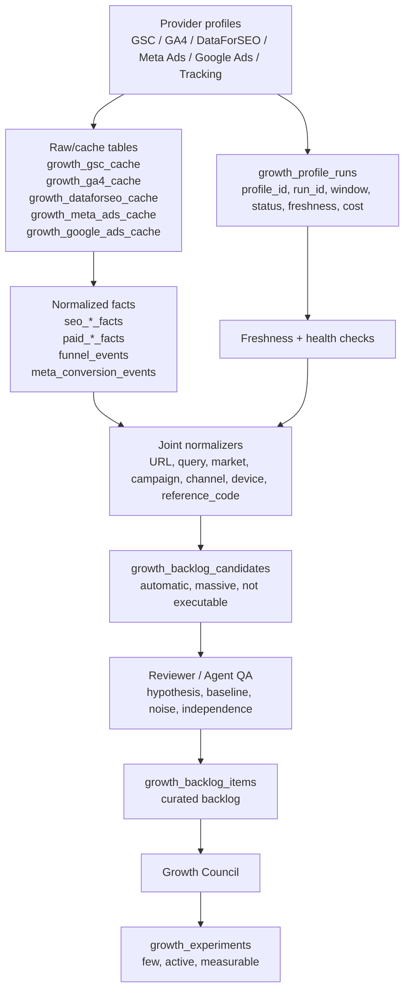
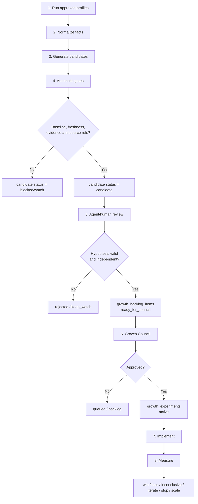

# SPEC: Growth OS Unified Backlog And Profile Run Ledger

Status: Draft implementable for EPIC #310 / SPEC #337  
Tenant: ColombiaTours (`colombiatours.travel`)  
Website id: `894545b7-73ca-4dae-b76a-da5b6a3f8441`  
Created: 2026-04-30  
Owner: A5 Growth Ops + A1 Backend + A3 Tracking + A4 SEO + SEM Lead  
Canonical execution: [#310](https://github.com/weppa-cloud/bukeer-studio/issues/310)  
Related SPECs: [#337](https://github.com/weppa-cloud/bukeer-studio/issues/337), [SPEC_GROWTH_OS_MAX_PERFORMANCE_MATRIX](./SPEC_GROWTH_OS_MAX_PERFORMANCE_MATRIX.md), [SPEC_GROWTH_OS_PAID_MEDIA_INTEGRATION](./SPEC_GROWTH_OS_PAID_MEDIA_INTEGRATION.md), [SPEC_META_CHATWOOT_CONVERSIONS](./SPEC_META_CHATWOOT_CONVERSIONS.md)

## Purpose

Define the durable Growth OS backlog architecture for automated or
agent-assisted execution. The system must read all normalized facts across SEO,
GSC, GA4, DataForSEO, tracking, Meta Ads and Google Ads, but it must not allow a
deterministic script to make strategic decisions by itself.

Operating rule:

```text
provider profile runs
  -> raw/cache
  -> normalized facts
  -> fact freshness + quality
  -> joint/correlation facts
  -> growth_backlog_candidates
  -> reviewer/agent promotion
  -> growth_backlog_items
  -> Growth Council
  -> growth_experiments
```

The design intentionally separates volume generation from decision governance:

- scripts generate candidates and evidence;
- agents/reviewers validate hypothesis, correlation and independence;
- Council approves active experiments;
- artifacts and GitHub remain the audit trail.

## Decisions

| Decision | Rule                                                                                                        |
| -------- | ----------------------------------------------------------------------------------------------------------- |
| D1       | Scripts can create `growth_backlog_candidates`, never active experiments.                                   |
| D2       | `growth_backlog_items` are created only after automated checks plus agent or human review.                  |
| D3       | `growth_experiments` are created only by Council approval.                                                  |
| D4       | Backlog can be large; active experiments stay capped by Council and must be independent.                    |
| D5       | Every candidate must store source fact refs, source profiles, windows, freshness and a reason.              |
| D6       | Every promotion must carry a hypothesis, baseline, owner, success metric and evaluation date.               |
| D7       | First-party CRM/funnel facts outrank platform-reported conversions for business truth.                      |
| D8       | Paid media enters the same flow as SEO/data providers; it is not a separate decision system.                |
| D9       | Facts with incompatible windows can still generate `WATCH`, but not `ready_for_council`.                    |
| D10      | Mutation automation for ads/content remains manual-first until launch smoke and rollback design are proven. |

## Non-Goals

- Do not replace Growth Council with an automatic optimizer.
- Do not publish content from candidates.
- Do not create, pause, scale or edit paid campaigns automatically in the first
  implementation.
- Do not store raw provider payloads in backlog or experiment tables.
- Do not mix remediation batches with active experiment slots.
- Do not treat stale SERP, GSC, GA4 or Ads data as equivalent to fresh data.
- Do not use platform conversion reports as qualified lead truth without
  `funnel_events` / CRM linkage.

## Data Flow



## Operational Flow



## Core Tables

### `growth_profile_runs`

Ledger for every provider/profile run. This is the foundation for frequency,
freshness and auditability.

| Field              | Type                 | Notes                                                                       |
| ------------------ | -------------------- | --------------------------------------------------------------------------- |
| `id`               | uuid                 | Primary key.                                                                |
| `website_id`       | uuid                 | Tenant website.                                                             |
| `profile_id`       | text                 | Example: `gsc_council_28d_query_page_v1`, `meta_ads_campaign_daily_v1`.     |
| `provider`         | text                 | `gsc`, `ga4`, `dataforseo`, `meta_ads`, `google_ads`, `tracking`.           |
| `provider_family`  | text                 | `first_party`, `seo_provider`, `paid`, `tracking`.                          |
| `account_id`       | text nullable        | Provider account/customer/ad account when applicable.                       |
| `run_id`           | text                 | Provider task id, generated run tag or job id.                              |
| `cadence`          | text                 | `continuous`, `daily`, `weekly`, `monthly`, `on_approval`.                  |
| `status`           | text                 | `planned`, `running`, `success`, `partial`, `failed`, `blocked`, `skipped`. |
| `started_at`       | timestamptz          | Run start.                                                                  |
| `completed_at`     | timestamptz nullable | Run completion.                                                             |
| `window_start`     | timestamptz nullable | Data window start.                                                          |
| `window_end`       | timestamptz nullable | Data window end.                                                            |
| `observed_at`      | timestamptz          | Snapshot observation time.                                                  |
| `row_count`        | integer              | Rows/items received or normalized.                                          |
| `cost`             | numeric nullable     | Paid provider cost where available.                                         |
| `currency`         | text nullable        | Usually `USD`.                                                              |
| `freshness_status` | text                 | `PASS`, `WATCH`, `BLOCKED`.                                                 |
| `quality_status`   | text                 | `PASS`, `WATCH`, `BLOCKED`.                                                 |
| `artifact_path`    | text nullable        | Local artifact path.                                                        |
| `error_class`      | text nullable        | Sanitized error class.                                                      |
| `evidence`         | jsonb                | No secrets or raw PII.                                                      |

Minimum unique key:

```text
website_id, profile_id, run_id
```

### `growth_backlog_candidates`

Automatic candidate table. Scripts can write here.

| Field                | Type                 | Notes                                                                                |
| -------------------- | -------------------- | ------------------------------------------------------------------------------------ |
| `id`                 | uuid                 | Primary key.                                                                         |
| `website_id`         | uuid                 | Tenant website.                                                                      |
| `candidate_key`      | text                 | Stable fingerprint of entity + type + source refs.                                   |
| `entity_type`        | text                 | `url`, `query`, `keyword`, `campaign`, `ad`, `landing`, `cluster`, `reference_code`. |
| `entity_key`         | text                 | Canonical URL, query, campaign id, etc.                                              |
| `work_type`          | text                 | See backlog work types below.                                                        |
| `title`              | text                 | Human-readable candidate.                                                            |
| `market`             | text nullable        | `CO`, `MX`, `US`, `EU`, etc.                                                         |
| `locale`             | text nullable        | `es-CO`, `es-MX`, `en-US`, etc.                                                      |
| `channel`            | text nullable        | `organic_search`, `paid_search`, `paid_social`, `ai_search`, `direct`, etc.          |
| `source_profiles`    | text[]               | Profiles used.                                                                       |
| `source_fact_refs`   | jsonb                | `[{table,id,profile,run_id}]`.                                                       |
| `profile_run_ids`    | uuid[]               | References to `growth_profile_runs`.                                                 |
| `window_start`       | timestamptz nullable | Comparable window start.                                                             |
| `window_end`         | timestamptz nullable | Comparable window end.                                                               |
| `freshness_status`   | text                 | `PASS`, `WATCH`, `BLOCKED`.                                                          |
| `quality_status`     | text                 | `PASS`, `WATCH`, `BLOCKED`.                                                          |
| `correlation_status` | text                 | `PASS`, `WATCH`, `BLOCKED`.                                                          |
| `priority_score`     | numeric              | Potential impact.                                                                    |
| `confidence_score`   | numeric              | Evidence/correlation confidence.                                                     |
| `baseline`           | text nullable        | Human-readable baseline summary.                                                     |
| `hypothesis`         | text nullable        | Required before promotion.                                                           |
| `confounders`        | text[]               | Possible alternate explanations.                                                     |
| `next_action`        | text                 | Suggested action.                                                                    |
| `status`             | text                 | `candidate`, `watch`, `blocked`, `rejected`, `promoted`.                             |
| `reject_reason`      | text nullable        | Required when rejected.                                                              |
| `evidence`           | jsonb                | Sanitized evidence and scoring reasons.                                              |
| `created_at`         | timestamptz          | Created.                                                                             |
| `updated_at`         | timestamptz          | Updated.                                                                             |

Scripts must upsert by:

```text
website_id, candidate_key
```

### `growth_backlog_items`

Curated backlog table. Agents/reviewers can promote candidates here.

| Field                 | Type          | Notes                                                                                                                                    |
| --------------------- | ------------- | ---------------------------------------------------------------------------------------------------------------------------------------- |
| `id`                  | uuid          | Primary key.                                                                                                                             |
| `website_id`          | uuid          | Tenant website.                                                                                                                          |
| `candidate_id`        | uuid nullable | Source candidate.                                                                                                                        |
| `item_key`            | text          | Stable key for dedupe.                                                                                                                   |
| `entity_type`         | text          | Same entity taxonomy as candidates.                                                                                                      |
| `entity_key`          | text          | URL/query/campaign/cluster/etc.                                                                                                          |
| `work_type`           | text          | Backlog type.                                                                                                                            |
| `title`               | text          | Work item title.                                                                                                                         |
| `market`              | text nullable | Market.                                                                                                                                  |
| `locale`              | text nullable | Locale.                                                                                                                                  |
| `channel`             | text nullable | Channel.                                                                                                                                 |
| `source_profiles`     | text[]        | Profiles represented.                                                                                                                    |
| `source_fact_refs`    | jsonb         | Source facts used.                                                                                                                       |
| `baseline`            | text          | Required for `ready_for_council`.                                                                                                        |
| `hypothesis`          | text          | Required for `ready_for_council`.                                                                                                        |
| `priority_score`      | numeric       | Impact.                                                                                                                                  |
| `confidence_score`    | numeric       | Correlation confidence.                                                                                                                  |
| `independence_key`    | text          | Landing/template/campaign/surface dedupe key.                                                                                            |
| `owner_role`          | text          | A1/A2/A3/A4/A5/SEM/Sales.                                                                                                                |
| `owner_issue`         | text          | GitHub issue.                                                                                                                            |
| `next_action`         | text          | Concrete next action.                                                                                                                    |
| `success_metric`      | text nullable | Required for Council.                                                                                                                    |
| `evaluation_date`     | date nullable | Required for Council.                                                                                                                    |
| `status`              | text          | `queued`, `ready_for_brief`, `brief_in_progress`, `ready_for_council`, `approved_for_execution`, `blocked`, `watch`, `done`, `rejected`. |
| `blocked_reason`      | text nullable | Required when blocked.                                                                                                                   |
| `council_decision_id` | uuid nullable | Latest Council decision.                                                                                                                 |
| `evidence`            | jsonb         | Sanitized evidence.                                                                                                                      |
| `created_at`          | timestamptz   | Created.                                                                                                                                 |
| `updated_at`          | timestamptz   | Updated.                                                                                                                                 |

### `growth_experiments`

Council-approved experiment table.

| Field              | Type          | Notes                                                                                           |
| ------------------ | ------------- | ----------------------------------------------------------------------------------------------- |
| `id`               | uuid          | Primary key.                                                                                    |
| `website_id`       | uuid          | Tenant website.                                                                                 |
| `backlog_item_id`  | uuid          | Source backlog item.                                                                            |
| `experiment_key`   | text          | Stable experiment key.                                                                          |
| `name`             | text          | Experiment name.                                                                                |
| `hypothesis`       | text          | Testable hypothesis.                                                                            |
| `baseline`         | text          | Baseline at approval.                                                                           |
| `owner_role`       | text          | Responsible owner.                                                                              |
| `owner_issue`      | text          | GitHub execution issue.                                                                         |
| `success_metric`   | text          | Primary metric.                                                                                 |
| `guardrail_metric` | text nullable | Regression guardrail.                                                                           |
| `start_date`       | date          | Start.                                                                                          |
| `evaluation_date`  | date          | Evaluation.                                                                                     |
| `status`           | text          | `planned`, `active`, `measuring`, `win`, `loss`, `inconclusive`, `paused`, `stopped`, `scaled`. |
| `independence_key` | text          | Used to prevent measurement collision.                                                          |
| `source_fact_refs` | jsonb         | Facts approved by Council.                                                                      |
| `decision_log`     | jsonb         | Council decisions and results.                                                                  |
| `created_at`       | timestamptz   | Created.                                                                                        |
| `updated_at`       | timestamptz   | Updated.                                                                                        |

## Existing Facts To Read

The unified generator must not be limited to content. It should read all
available facts and degrade gracefully where a table is not approved yet.

| Domain                 | Tables / sources                                                                                 | Use                                                                     |
| ---------------------- | ------------------------------------------------------------------------------------------------ | ----------------------------------------------------------------------- |
| Technical SEO          | `seo_audit_results`, `seo_audit_findings`                                                        | technical blockers, WATCH validation, remediation rows.                 |
| DataForSEO demand/SERP | `seo_keyword_opportunities`, `seo_serp_snapshots`                                                | content, SERP, competitor, local pack and paid/SEO opportunities.       |
| GSC                    | `seo_gsc_daily_facts`, `seo_gsc_segment_facts`, `growth_gsc_cache` fallback                      | demand, CTR, market, device, trend, search appearance.                  |
| GA4                    | `seo_ga4_landing_facts`, `seo_ga4_event_facts`, `seo_ga4_geo_facts`, `growth_ga4_cache` fallback | landing activation, channel quality, events and conversion gaps.        |
| Tracking               | `funnel_events`, `meta_conversion_events`, `waflow_leads`, CRM refs where allowed                | first-party conversion truth and attribution quality.                   |
| Paid media             | `paid_*_facts`, `growth_meta_ads_cache`, `growth_google_ads_cache` fallback                      | spend, campaign health, search terms, creative and landing performance. |
| AI/GEO                 | `seo_ai_visibility_facts`, AI visibility artifacts                                               | AI search visibility and citation gaps.                                 |
| Authority/local        | `seo_backlink_facts`, `seo_local_reputation_facts`, fallbacks where access is blocked            | authority, listings, review/reputation backlog.                         |

## Cadence And Freshness

Each profile defines its own cadence. Candidate generation must evaluate
freshness relative to the profile cadence, not relative to wall-clock age only.

| Profile family              | Typical cadence              | Freshness PASS example                                          | Notes                                                                   |
| --------------------------- | ---------------------------- | --------------------------------------------------------------- | ----------------------------------------------------------------------- |
| Tracking/funnel             | continuous/daily             | last success <= 24h                                             | Required for paid and CRO scale.                                        |
| Meta Ads / Google Ads daily | daily                        | latest completed day or provider delay window                   | Use provider delay metadata; do not require real-time.                  |
| GA4 daily                   | daily                        | latest completed day or 28d window ending within expected delay | GA4 can lag; mark `WATCH`, not `BLOCKED`, when fallback cache is valid. |
| GSC daily                   | daily                        | latest completed day available from Search Console              | Search Console has normal delay; evaluate accordingly.                  |
| GSC/GA4 Council 28d         | weekly                       | current Council window                                          | Required for Council readouts.                                          |
| DataForSEO OnPage           | weekly/quincenal while WATCH | latest approved crawl                                           | Expensive; approval-gated.                                              |
| DataForSEO SERP/Labs        | monthly or sprint-approved   | current sprint/month                                            | Snapshot facts older than profile TTL become `WATCH`.                   |
| AI/GEO                      | monthly                      | current month/prompt set                                        | LLM Mentions remains blocked until access is active.                    |
| Backlinks                   | monthly/quarterly            | current month/quarter                                           | Blocked if subscription is unavailable.                                 |
| Business/Reviews            | weekly/monthly               | verified CID/place id and current run                           | Blocked until CID/place id exists.                                      |

Freshness status rules:

| Status    | Meaning                                                                                    |
| --------- | ------------------------------------------------------------------------------------------ |
| `PASS`    | Profile ran within approved cadence and facts are usable.                                  |
| `WATCH`   | Facts are usable but partial, stale, from fallback cache, or from a non-comparable window. |
| `BLOCKED` | Required profile/fact is missing, failed, access-blocked, or lacks required identifiers.   |

## Correlation Model

The system must correlate by shared entities, not by vague text matching.

| Entity                         | Joins                                                                    |
| ------------------------------ | ------------------------------------------------------------------------ |
| `canonical_url`                | technical facts, GSC page, GA4 landing, paid landing, funnel source URL. |
| `query` / `keyword`            | GSC query, DataForSEO keyword, Google Ads search term, SERP snapshot.    |
| `market` / `locale`            | GSC country, GA4 geo, DataForSEO location/language, paid targeting.      |
| `device`                       | GSC device, GA4 device, paid device breakdown.                           |
| `channel`                      | GA4 channel/source/medium, paid platform, tracking channel.              |
| `campaign_id` / `utm_campaign` | paid campaign, GA4 campaign, funnel events, landing performance.         |
| `reference_code`               | WAFlow, CRM request, itinerary, funnel events.                           |
| `click_id`                     | `fbclid`, `_fbc`, `_fbp`, `gclid`, `gbraid`, `wbraid`.                   |
| `cluster`                      | keyword/content cluster, authority/content fit and Council workstreams.  |

Correlation status rules:

| Status    | Rule                                                                   |
| --------- | ---------------------------------------------------------------------- |
| `PASS`    | Facts share entity keys and compatible windows.                        |
| `WATCH`   | Entity match exists but windows, freshness or identifiers are partial. |
| `BLOCKED` | No stable join key or required tracking/CRM link is missing.           |

## Confounders

Every candidate should include possible confounders when relevant.

| Confounder              | Example                                                                 |
| ----------------------- | ----------------------------------------------------------------------- |
| Window mismatch         | GSC 28d, GA4 7d and Ads yesterday are mixed.                            |
| Locale mismatch         | EN-US demand points to ES page or legacy subdomain.                     |
| Global template change  | CTA or metadata template affects many pages at once.                    |
| Campaign learning phase | Paid performance changes from auction/learning, not landing.            |
| CRM operations          | Sales response, pricing, quote quality or inventory affects close rate. |
| Provider delay          | GSC, GA4, Meta or Google Ads data is not final yet.                     |
| Tracking gap            | Missing click ids, missing WAFlow refs or skipped CAPI events.          |
| Content quality         | Translation/accuracy gate blocks publication despite demand.            |
| SERP volatility         | Snapshot may not represent stable demand.                               |

## Work Types

| Work type                              | Source examples                           | Output                                     |
| -------------------------------------- | ----------------------------------------- | ------------------------------------------ |
| `technical_remediation`                | DataForSEO OnPage, GSC/GA4 impact         | #313 remediation.                          |
| `content_brief_new`                    | DataForSEO Labs/SERP, GSC demand          | #314/#315/#316 content backlog.            |
| `content_optimization`                 | GSC CTR, GA4 activation, SERP competitors | Existing-page improvement.                 |
| `locale_quality`                       | EN/MX quality gate, hreflang, GSC locale  | Localization backlog.                      |
| `cro_activation_gap`                   | GA4 landing/event + funnel                | CTA/WAFlow/landing experiment.             |
| `tracking_gap`                         | funnel/CAPI/CRM refs                      | #322/#330/#332/#333 tracking work.         |
| `paid_wasted_spend`                    | paid campaign/search term + funnel        | pause/negative/landing fix recommendation. |
| `paid_search_term_content_opportunity` | Google search terms + GSC/DataForSEO      | SEO/SEM content backlog.                   |
| `paid_landing_activation_gap`          | paid landing + GA4/funnel                 | CRO or campaign pause row.                 |
| `seo_paid_cannibalization_watch`       | paid term + organic rank                  | budget/SEO governance row.                 |
| `authority_gap`                        | Backlinks/Labs/Domain Analytics           | #334 authority/PR row.                     |
| `local_reputation_gap`                 | Business/Reviews/local SERP               | #335 local SEO row.                        |
| `ai_geo_visibility_gap`                | AI/GEO facts, SERP, content               | #384 AI search row.                        |

## Scoring

Use two separate scores.

### Priority score

Measures potential value:

- demand volume or impressions;
- current traffic/sessions;
- paid spend at risk;
- commercial intent;
- conversion or activation gap;
- technical severity;
- strategic market importance;
- competitive gap.

### Confidence score

Measures reliability of the recommendation:

- source profile freshness;
- compatible windows;
- stable entity joins;
- first-party tracking evidence;
- CRM/funnel linkage;
- low confounder risk;
- repeatability across runs;
- human/agent QA status.

Council readiness requires both:

```text
priority_score >= configured threshold
confidence_score >= configured threshold
```

or an explicit Council exception recorded in `evidence`.

## Promotion Rules

### Candidate generation

Scripts may generate candidates when:

- at least one source fact exists;
- `source_fact_refs` are present;
- `source_profiles` are present;
- `freshness_status` is computed;
- `priority_score` and `confidence_score` are computed;
- `next_action` is concrete.

Scripts must not set `ready_for_council` or `active`.

### Candidate to backlog item

Agent/human reviewer may promote when:

- hypothesis is coherent;
- baseline exists or blocked reason is explicit;
- confounders are listed;
- independence key is set;
- owner issue and owner role are set;
- status becomes `queued`, `ready_for_brief`, `ready_for_council`, `watch` or
  `blocked`.

### Backlog item to experiment

Council may approve when:

- baseline is complete;
- owner and execution issue are assigned;
- success metric and evaluation date are set;
- tracking gate is `PASS` or `PASS-WITH-WATCH` with documented risk;
- independence key does not collide with active experiments unless Council
  intentionally runs a grouped batch;
- active experiment cap is respected.

## Independence Rules

Only one active experiment may own the same independence key unless Council
marks it as a grouped batch.

Potential independence keys:

| Surface       | Key                                 |
| ------------- | ----------------------------------- |
| Page          | `url:<canonical_url>`               |
| Template      | `template:<template_name>`          |
| CTA           | `cta:<cta_id_or_surface>`           |
| Campaign      | `campaign:<platform>:<campaign_id>` |
| Query cluster | `cluster:<market>:<cluster>`        |
| Tracking path | `tracking:<event_chain>`            |
| Locale launch | `locale:<locale>:<section>`         |

Global changes, such as CTA template, sitemap, hreflang, tracking or campaign
conversion goal changes, must be modeled as dependencies or grouped experiments,
not silently mixed into page-level experiments.

## Paid Media Integration Rules

Paid media facts follow
[SPEC_GROWTH_OS_PAID_MEDIA_INTEGRATION](./SPEC_GROWTH_OS_PAID_MEDIA_INTEGRATION.md).
This spec adds how they enter unified backlog generation.

### Paid facts can create candidates for:

- wasted spend;
- high CTR but low qualified lead rate;
- landing activation gap;
- negative keywords;
- search-term content opportunities;
- geo/market fit;
- tracking blocked;
- Meta CAPI quality gap;
- Google enhanced conversion/Data Manager gap;
- SEO vs paid cannibalization;
- retargeting opportunity.

### Paid candidates are blocked when:

- selected ad account is missing;
- profile run is stale or failed;
- click ids are missing for a paid experiment;
- UTM convention fails;
- landing returns non-200, hidden locale, soft-404 or accidental noindex;
- no WAFlow/funnel baseline exists;
- CRM/funnel chain is missing for scale decisions.

### Paid candidates can be `ready_for_council` when:

- platform account and campaign/adset/ad/keyword/search term are identified;
- spend/click/conversion baseline exists;
- landing URL and UTM join to GA4/funnel facts;
- first-party qualified lead or booking/itinerary truth exists, or the gap is
  explicitly the experiment;
- kill rule and budget cap are present.

## Agent Roles

| Agent                     | Scope                                                         | Allowed writes                                                      |
| ------------------------- | ------------------------------------------------------------- | ------------------------------------------------------------------- |
| Profile Runner Agent      | Executes approved profiles and records `growth_profile_runs`. | profile run ledger, provider cache/artifacts.                       |
| Normalizer Agent          | Converts cache/raw into facts.                                | fact tables, quality artifacts.                                     |
| Candidate Generator Agent | Creates deterministic candidates.                             | `growth_backlog_candidates`, artifacts.                             |
| Reviewer Agent            | Validates hypothesis, confounders, independence and baseline. | `growth_backlog_items`; cannot activate experiments.                |
| Council Agent             | Prepares Council packet and enforces rules.                   | Council artifact, `growth_experiments` only after Council approval. |
| Publisher/Execution Agent | Implements approved work.                                     | code/content/config only from approved item/experiment.             |
| Validator Agent           | Reviews facts, gates, freshness and outcomes.                 | validation artifacts and issue comments.                            |

## Automatable Commands

Initial scripts:

```bash
# Run approved provider profiles and normalize facts.
node scripts/seo/run-growth-weekly-intake.mjs \
  --apply true \
  --runApprovedDataForSeoProfiles true \
  --approvedDataForSeoSeedProfiles en-us-content,mx-es-content

# Generate content-scale candidates only.
node scripts/seo/prepare-growth-content-scale-batch.mjs \
  --outDir artifacts/seo/$(date +%F)-growth-content-scale-batch
```

Recommended new scripts:

```bash
# Writes growth_backlog_candidates from all available facts.
node scripts/seo/generate-growth-unified-backlog.mjs --apply true

# Validates candidates and produces blocked/watch/promotable summaries.
node scripts/seo/validate-growth-unified-backlog.mjs

# Produces Council packet from growth_backlog_items and active experiments.
node scripts/seo/generate-growth-council-packet.mjs
```

## Acceptance Criteria

- `growth_profile_runs` records every GSC, GA4, DataForSEO, tracking and paid
  profile run with cadence, window, status, freshness and artifact path.
- Unified candidate generator reads all approved fact tables and creates
  `growth_backlog_candidates`.
- Candidates include source fact refs, profile run ids, freshness, confidence,
  priority, hypothesis or blocked reason, and confounders.
- Candidate generator cannot create active experiments.
- Reviewer promotion creates `growth_backlog_items` with owner, issue,
  independence key, baseline and next action.
- Council packet shows active experiments, queued backlog, blocked/watch rows,
  rejected rows and independence collisions.
- Council can promote at most the configured number of independent active
  experiments unless a grouped-batch exception is recorded.
- Paid media candidates are blocked unless selected accounts, UTM/click id
  capture, landing health and first-party measurement gates are satisfied.
- Artifacts remain generated for GitHub evidence.
- No raw provider JSON or raw PII is stored in backlog/experiment tables.

## Test Plan

- Migration dry-run validates tables, indexes and RLS.
- Seed fixture with intentionally stale GSC, fresh GA4 and current SERP must
  produce `WATCH`, not `ready_for_council`.
- Fixture with paid campaign spend but missing WAFlow/funnel must produce
  `paid_tracking_blocked`.
- Fixture with Google search term + GSC demand + no content page must produce
  `paid_search_term_content_opportunity`.
- Fixture with technical P1 and high traffic must produce
  `technical_remediation`.
- Fixture with same page appearing in three facts must dedupe by
  `independence_key`.
- Council packet rejects rows without baseline, owner, metric or evaluation
  date.
- Freshness report marks Backlinks and LLM Mentions `BLOCKED/WATCH` while
  subscription access is unavailable.

## Migration Governance

Shared DB changes must originate from or be mirrored in `bukeer-flutter` as the
operational SSOT for Supabase migrations.

Recommended migration order:

1. `growth_profile_runs`
2. `growth_backlog_candidates`
3. `growth_backlog_items`
4. `growth_experiments`
5. optional views for Council and health/freshness

Until migrations are approved, scripts may produce artifacts only and may use
controlled metadata in existing caches. They must not pretend that the backlog
is durable.

## Open Questions

No blocking product questions remain for the spec draft. Implementation should
confirm:

- exact table names with the Flutter migration owner;
- active experiment cap per Council cycle;
- whether `growth_inventory` remains as executive summary table or becomes a
  compatibility view over `growth_backlog_items`;
- whether paid provider usage gets a dedicated `paid_provider_usage` table or
  temporarily extends `seo_provider_usage` with `provider_family='paid'`.
