# ColombiaTours Growth OS 2026 - Infografias para marketing

Actualizado: 2026-04-26  
Fuente canonica: [#337 SPEC](https://github.com/weppa-cloud/bukeer-studio/issues/337)  
Epic de ejecucion: [#310](https://github.com/weppa-cloud/bukeer-studio/issues/310)  
Milestone: `ColombiaTours Growth OS 90D`

Este material explica el modelo al equipo de marketing. No reemplaza los issues:
GitHub sigue siendo la fuente de verdad para alcance, estado y aceptacion.

## Infografia general

El Growth OS convierte marketing en un sistema de decisiones. El trafico es una
entrada; el objetivo real es aumentar solicitudes calificadas, cotizaciones,
reservas y aprendizaje semanal con atribucion trazable.

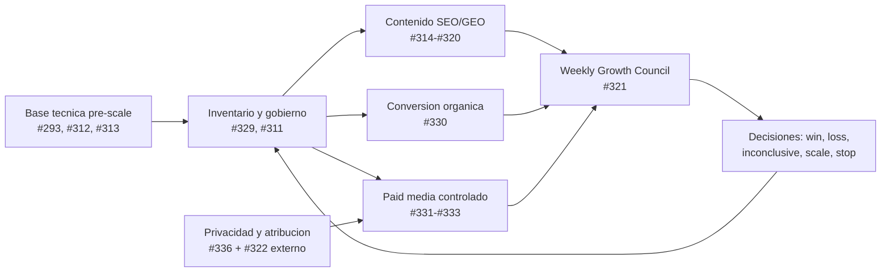

| Capa | Que significa para marketing | Issues |
|---|---|---|
| Fundacion tecnica | El sitio debe poder ser rastreado, entendido, indexado y medido antes de escalar. | #293, #312, #313 |
| Sistema de mando | Un backlog transversal, maximo 5 experimentos activos y una metrica norte. | #329, #311, #321 |
| Crecimiento organico | Contenido ES, EN-US, Mexico, entidades, E-E-A-T y autoridad conectados a conversion. | #314-#320, #334, #335 |
| Conversion | WAFlow, WhatsApp y planner routing se miden como activacion, no solo como botones. | #330 |
| Paid media | Google Ads, Meta y TikTok solo escalan con naming, UTMs, eventos y privacidad listos. | #331, #332, #333, #336, #322 |

## Funnel operativo

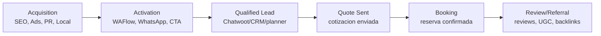

| Etapa | Pregunta de marketing | Senal minima |
|---|---|---|
| Acquisition | Que paginas, clusters o campanas traen demanda calificada? | clicks, sesiones, posicion, spend, CTR |
| Activation | Que porcentaje inicia WAFlow o WhatsApp? | `waflow_open`, `waflow_submit`, `whatsapp_cta_click` |
| Qualified Lead | Cuales leads sirven para vender viajes reales? | `qualified_lead` |
| Quote Sent | Que fuentes llegan a cotizacion? | `quote_sent` |
| Booking | Que canales generan reservas confirmadas? | `booking_confirmed`, valor, margen |
| Review/Referral | Que activos crean confianza y autoridad? | reviews, menciones, backlinks |

## Roadmap 90 dias

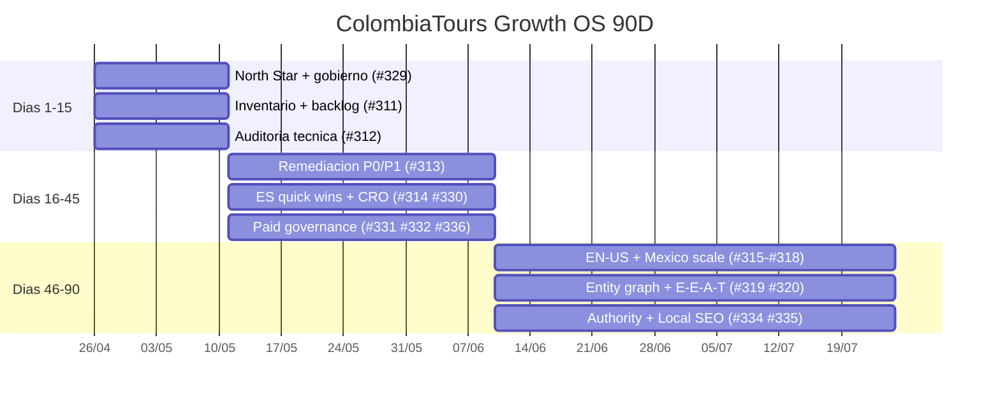

## Mapa de issues

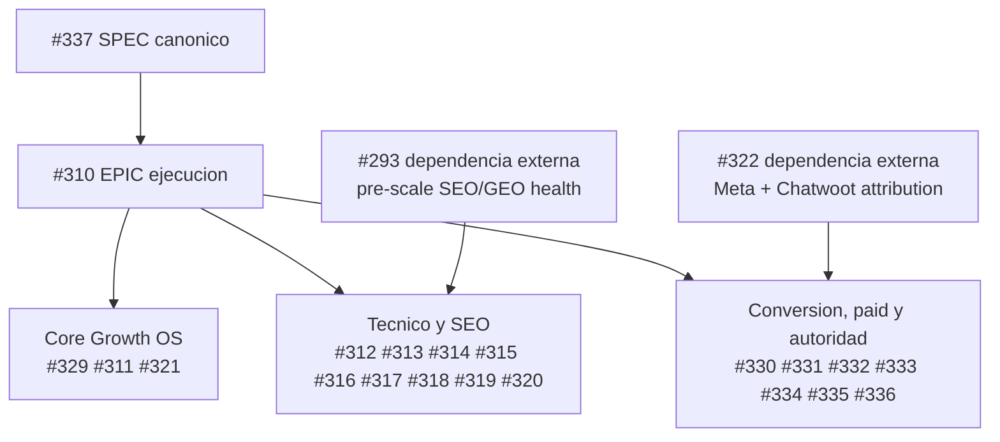

## Tarjetas infograficas por issue

### #310 - EPIC: ColombiaTours Growth Operating System 2026

| Campo | Lectura para marketing |
|---|---|
| Rol | Tablero ejecutivo de ejecucion del Growth OS. |
| Objetivo | Operar ColombiaTours como sistema cross-channel, no como roadmap SEO aislado. |
| North Star | Solicitudes de viaje calificadas por mes. |
| Resultado final | Reservas confirmadas atribuidas a canales de crecimiento por mes. |
| Reglas | Maximo 5 experimentos activos, cada uno con hipotesis, baseline, owner, metrica y fecha de evaluacion. |
| Bloqueos | No escalar contenido si #312/#313 esta `BLOCKED`; no escalar paid sin #322/#332/#333/#336. |

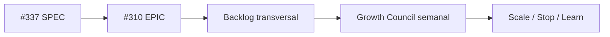

### #311 - Growth Inventory + AARRR Experiment Dashboard

| Campo | Lectura para marketing |
|---|---|
| Rol | Command center del Growth OS. |
| Objetivo | Una fila por URL, cluster, mercado, campana o experimento con metrica, estado y proxima accion. |
| Produce | Inventario top 100 URLs, backlog ICE/RICE y candidatos para SEO, CRO, paid y autoridad. |
| Mide | GSC, GA4, WAFlow, WhatsApp, leads, cotizaciones, reservas, valor y margen cuando esten disponibles. |
| Regla clave | Nada pasa a `in_progress` sin hipotesis, baseline, owner, success metric y evaluation date. |
| Entrega a | #312/#313, #314-#318, #330, #331-#335. |

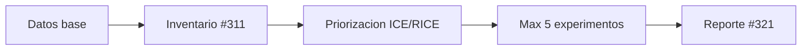

### #312 - Live technical audit top 100 URLs

| Campo | Lectura para marketing |
|---|---|
| Rol | Gate tecnico antes de escalar contenido. |
| Objetivo | Auditar produccion real de `colombiatours.travel` con top URLs, redirects, sitemap, canonical, hreflang, schema, assets y analytics. |
| Produce | Matriz top 100 con severidad, owner issue y decision `PASS`, `PASS-WITH-WATCH` o `BLOCKED`. |
| Mide | Estado final, indexabilidad, canonical, hreflang, sitemap, schema, assets, performance y tracking. |
| Riesgo que evita | Producir contenido o paid traffic sobre paginas que Google no puede indexar o que no convierten. |
| Entrega a | #313 para P0/P1 y #321 para watch items. |

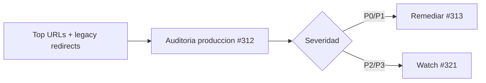

### #313 - Fix P0/P1 indexability, canonical, hreflang and sitemap issues

| Campo | Lectura para marketing |
|---|---|
| Rol | Remediacion tecnica prioritaria. |
| Objetivo | Corregir bloqueos de crawl, indexacion, canonical, hreflang, sitemap, schema, assets y performance antes de escalar. |
| Produce | Lista de fixes P0/P1 con reproduccion, owner, evidencia de deploy y validacion. |
| P0 | 5xx, lead flow roto, soft-404, canonical incorrecto, noindex, robots block, loops de hreflang. |
| P1 | Missing sitemap, schema invalido, imagenes rotas, redirects lentos, tracking no visible, regresiones de performance. |
| Decision | #310 pasa a `PASS` o `PASS-WITH-WATCH` antes de escalar fases 3/4. |

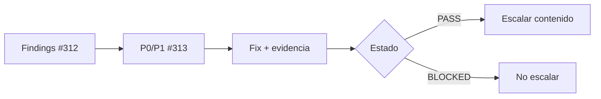

### #314 - Audit and optimize Spanish priority content

| Campo | Lectura para marketing |
|---|---|
| Rol | Quick wins editoriales ES. |
| Objetivo | Mejorar paginas prioritarias en espanol por intencion, profundidad, frescura, fuentes, enlaces internos, FAQs y conversion. |
| Produce | Cambios de contenido medibles en paginas ES de alto potencial. |
| Mide | GSC, GA4, DataForSEO, auditoria renderizada y activacion WAFlow/WhatsApp. |
| Depende de | #311 para priorizacion y #312/#313 para no optimizar sobre paginas bloqueadas. |
| Criterio de exito | Mejor visibilidad y activacion en paginas con demanda existente. |

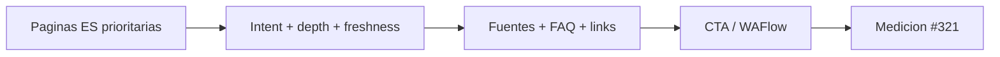

### #315 - EN-US keyword universe with DataForSEO

| Campo | Lectura para marketing |
|---|---|
| Rol | Investigacion de demanda EN-US. |
| Objetivo | Crear universo de keywords nativo EN-US por cluster antes de traducir o transcrear. |
| Produce | Clusters, intenciones, prioridades y oportunidades por mercado. |
| Mide | Volumen, dificultad, SERP features, competidores y oportunidad comercial. |
| Depende de | #311 para inventario y #321 para reporting. |
| Riesgo que evita | Traducir literalmente contenido ES sin demanda real en ingles. |

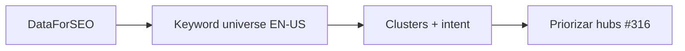

### #316 - Transcreate and publish EN-US priority hubs

| Campo | Lectura para marketing |
|---|---|
| Rol | Ejecucion editorial EN-US. |
| Objetivo | Transcrear y publicar primeros hubs EN-US con contenido visible, hreflang, schema, canonical y enlaces internos. |
| Produce | Hubs comerciales e informacionales en ingles listos para captar demanda. |
| Mide | GSC EN, GA4 EN, DataForSEO, indexabilidad y conversion. |
| Depende de | #315 para keywords y #312/#313 para salud tecnica. |
| Regla | Transcreacion, no traduccion literal. |

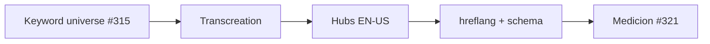

### #317 - Mexico commercial funnel cluster

| Campo | Lectura para marketing |
|---|---|
| Rol | Funnel comercial para viajeros desde Mexico. |
| Objetivo | Crear u optimizar cluster Mexico alrededor de costos, requisitos, paquetes y planeacion de viaje a Colombia. |
| Produce | Rutas y contenidos con intencion comercial para mercado MX. |
| Mide | Queries MX, sesiones, WAFlow/WhatsApp, leads y cotizaciones. |
| Depende de | #311 para segmentacion por mercado y #321 para no mezclar MX con ES/EN global. |
| Riesgo que evita | Tomar decisiones agregadas que escondan comportamiento del mercado mexicano. |


### #318 - EN-US safety and best-time clusters

| Campo | Lectura para marketing |
|---|---|
| Rol | Clusters informacionales-comerciales EN-US. |
| Objetivo | Crear u optimizar contenidos sobre seguridad en Colombia y mejor epoca para viajar. |
| Produce | Activos que responden dudas de alto impacto antes de la conversion. |
| Mide | Visibilidad EN-US, engagement, clicks internos a paquetes y activacion. |
| Conecta con | #316 para hubs EN-US, #320 para fuentes/E-E-A-T y #334 para activos linkables. |
| Riesgo que evita | Captar trafico informacional sin puentes hacia solicitud de viaje. |

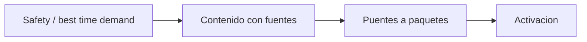

### #319 - Colombia destination entity graph

| Campo | Lectura para marketing |
|---|---|
| Rol | Arquitectura semantica de destinos. |
| Objetivo | Conectar hubs, blogs, actividades y paquetes para Cartagena, Medellin, Bogota, Guatape, San Andres, Valle del Cocora y Eje Cafetero. |
| Produce | Grafo interno de entidades y enlaces que ayuda a Google, LLMs y usuarios a entender la oferta. |
| Mide | Cobertura por destino, enlaces internos, ranking por cluster, engagement y conversion. |
| Conecta con | #314, #316, #317, #318, #334. |
| Riesgo que evita | Contenido aislado que no transfiere autoridad ni conduce a productos. |

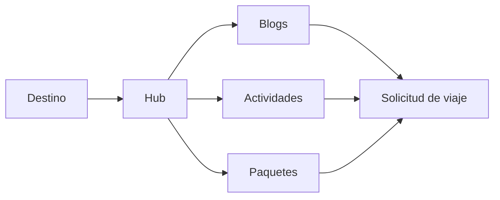

### #320 - E-E-A-T planner/reviewer and source blocks

| Campo | Lectura para marketing |
|---|---|
| Rol | Confianza visible y calidad editorial. |
| Objetivo | Agregar planner/reviewer, fuentes oficiales, metodologia, fechas de actualizacion y proof blocks en paginas prioritarias. |
| Produce | Senales visibles de experiencia, autoridad y confianza. |
| Mide | Auditorias SEO, engagement, conversion y potencial de rich/AI visibility. |
| Conecta con | #314, #318, #319, #334, #335. |
| Riesgo que evita | Contenido turistico generico sin prueba, fuente ni responsable. |

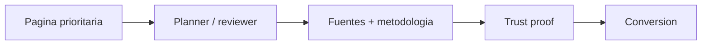

### #321 - Weekly Growth Council + reporting

| Campo | Lectura para marketing |
|---|---|
| Rol | Ciclo semanal de aprendizaje y decision. |
| Objetivo | Conectar SEO, paid, WAFlow/WhatsApp, Chatwoot/CRM y planner outcomes con la North Star. |
| Produce | Reporte semanal con decision `GREEN`, `WATCH`, `BLOCKED` o `REGRESSION`. |
| Mide | Clicks, sesiones, WAFlow submits, qualified leads, quote sent, bookings, revenue, clusters, paid, autoridad y tecnica. |
| Regla | Cada experimento terminado debe registrar resultado y aprendizaje. |
| Salida | Maximo 5 experimentos para la semana siguiente. |

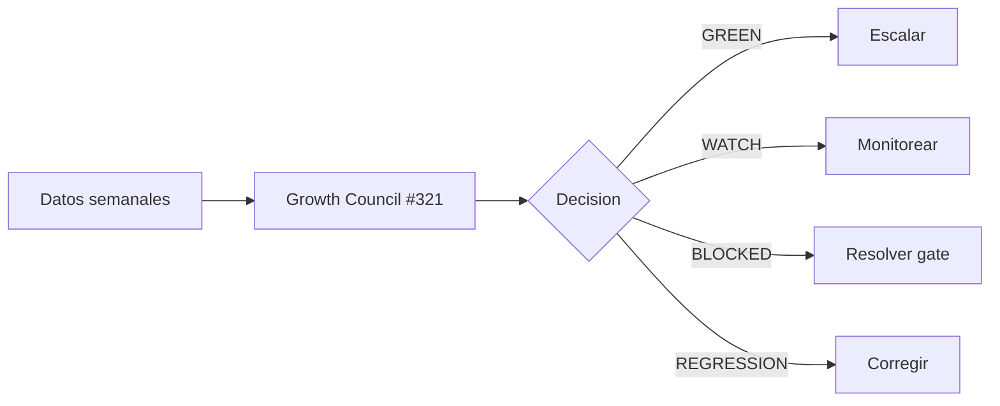

### #329 - North Star, AARRR funnel and governance cadence

| Campo | Lectura para marketing |
|---|---|
| Rol | Definicion del sistema operativo. |
| Objetivo | Alinear una North Star, un funnel AARRR, un Growth Council semanal y un decision log. |
| Produce | Agenda, reglas, estados de experimento y cadencia Monday Growth Council. |
| Metrica norte | Solicitudes de viaje calificadas por mes. |
| Resultado | Reservas confirmadas atribuidas a canales de crecimiento por mes. |
| Regla | Paid, SEO, CRM y planner usan el mismo backlog. |


### #330 - Organic CRO for WAFlow, WhatsApp CTA and planner routing

| Campo | Lectura para marketing |
|---|---|
| Rol | Conversion organica. |
| Objetivo | Medir y optimizar el paso de trafico organico a solicitud de viaje calificada. |
| Produce | Baseline top 20 landing pages, 5 experimentos CRO ICE-scored y aprendizajes. |
| Mide | WAFlow open, WAFlow submit, WhatsApp CTA click, planner routing, qualified lead. |
| Depende de | #311 para inventario y #321 para aprendizajes. |
| Riesgo que evita | Celebrar trafico que no genera conversaciones utiles. |

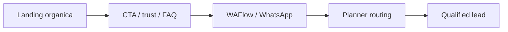

### #331 - Paid media governance for Google Ads, Meta and TikTok

| Campo | Lectura para marketing |
|---|---|
| Rol | Gobierno de campanas pagas. |
| Objetivo | Evitar que paid media sea un silo; todo debe salir del backlog Growth OS. |
| Produce | Naming, UTMs, roles por canal, budget guardrails y ventanas de evaluacion. |
| Canales | Google Ads captura alta intencion; Meta activa demanda latente y remarketing; TikTok discovery y creator proof. |
| Bloqueo | Paid scale esta `BLOCKED` hasta #322, #332, #333 y #336 o waiver explicito. |
| Regla | Ninguna campana optimiza solo a trafico salvo top-of-funnel explicito. |

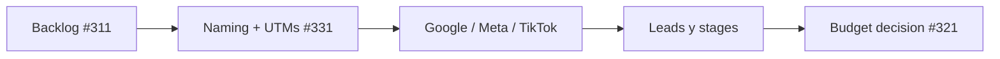

### #332 - Google Ads enhanced conversions and offline lead stages

| Campo | Lectura para marketing |
|---|---|
| Rol | Medicion avanzada para Google Ads. |
| Objetivo | Que Google optimice mas alla de clicks y leads crudos, usando etapas offline. |
| Produce | Plan de tracking, soporte para `gclid`, `gbraid`, `wbraid`, conversion actions y QA. |
| Etapas | `qualified_lead`, `quote_sent`, `booking_confirmed`. |
| Depende de | #322 para modelo de atribucion y #336 para privacidad. |
| Riesgo que evita | Optimizar presupuesto hacia leads baratos que no llegan a cotizacion o reserva. |

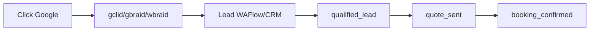

### #333 - TikTok Events API and event deduplication

| Campo | Lectura para marketing |
|---|---|
| Rol | Medicion para discovery y creator-style campaigns. |
| Objetivo | Preparar TikTok Pixel + Events API sin doble conteo. |
| Produce | Tracking plan, persistencia de `ttclid`, reglas `event_id` y checklist de lanzamiento. |
| Mide | Eventos WAFlow/WhatsApp mapeados a funnel TikTok. |
| Depende de | #322 para atribucion y #336 para privacidad. |
| Riesgo que evita | Reportar conversiones duplicadas entre navegador y servidor. |

```mermaid
flowchart LR
  A["TikTok click"] --> B["ttclid"]
  B --> C["Pixel event"]
  B --> D["Server event"]
  C --> E["shared event_id"]
  D --> E
  E --> F["Dedupe"]
```

### #334 - Digital PR, backlinks and authority pipeline

| Campo | Lectura para marketing |
|---|---|
| Rol | Autoridad externa. |
| Objetivo | Cerrar brecha competitiva de backlinks y autoridad para crecer en EN-US y mercados competitivos. |
| Produce | Pipeline de 50 prospectos, 10 primeros targets con asset/topic match y backlog de activos linkables. |
| Activos | Guias de costos, seguridad, itinerarios, requisitos y recursos firmados por planners. |
| Conecta con | #314, #316, #317, #318, #319, #320. |
| Mide | Acciones de outreach, links ganados/perdidos, menciones y autoridad por cluster. |

```mermaid
flowchart LR
  A["Linkable assets"] --> B["Prospectos PR"]
  B --> C["Outreach"]
  C --> D["Backlinks / mentions"]
  D --> E["Authority lift"]
```

### #335 - Local SEO, Google Business Profile and reviews operating model

| Campo | Lectura para marketing |
|---|---|
| Rol | Reputacion local y prueba social. |
| Objetivo | Convertir reviews, presencia local y Google surfaces en parte del sistema de crecimiento. |
| Produce | GBP audit, workflow post-trip de reviews y mapping de proof blocks por pagina. |
| Mide | Reviews, respuestas, GBP completeness, acciones locales y uso de testimonios. |
| Conecta con | #320 para trust blocks y #321 para reporting. |
| Riesgo que evita | Manejar reputacion como tarea ad hoc sin impacto en paginas ni conversion. |

```mermaid
flowchart LR
  A["Post-trip"] --> B["Review request"]
  B --> C["GBP / testimonials"]
  C --> D["Proof blocks"]
  D --> E["Trust + conversion"]
```

### #336 - Attribution privacy and data governance gate

| Campo | Lectura para marketing |
|---|---|
| Rol | Gate de privacidad antes de escalar atribucion y paid. |
| Objetivo | Definir reglas para identificadores publicitarios, datos de contacto, valor de reserva, logs y respuestas de proveedores. |
| Produce | Clasificacion de datos, redaccion, RLS/service-role boundaries, consentimiento, retencion y payload rules. |
| Aplica a | `gclid`, `gbraid`, `wbraid`, `fbclid`, `ttclid`, UTMs, IP-derived metadata, user agent, contacto y booking value. |
| Bloquea | #331 paid scale hasta que este completo o tenga waiver explicito. |
| Riesgo que evita | Escalar medicion con datos sensibles sin frontera de acceso, logs seguros o reglas de proveedor. |

```mermaid
flowchart LR
  A["Ad IDs + lead data"] --> B["Clasificacion #336"]
  B --> C["Redaccion + RLS"]
  C --> D["Payload rules"]
  D --> E["Paid scale permitido"]
```

### #337 - SPEC: ColombiaTours Growth Operating System 2026

| Campo | Lectura para marketing |
|---|---|
| Rol | Especificacion canonica y fuente de verdad conceptual. |
| Objetivo | Definir el sistema completo: objetivo, funnel, roles de canales, contratos, reglas, ADR compliance y roadmap 90D. |
| Produce | Modelo operativo que #310 ejecuta. |
| Incluye | Growth Inventory contract, event/attribution contract, experiment rules, roadmap y guardrails. |
| Regla | Local specs son stubs; cambios de alcance se hacen en GitHub. |
| Decision clave | Trafico es input; exito real es leads calificados, cotizaciones, reservas y atribucion. |

```mermaid
flowchart LR
  A["#337 SPEC"] --> B["Contratos"]
  A --> C["Guardrails"]
  A --> D["Roadmap 90D"]
  B --> E["#310 ejecucion"]
  C --> E
  D --> E
```

## Dependencias externas que marketing debe entender

### #293 - Pre-scale SEO/GEO technical health dependency

| Campo | Lectura para marketing |
|---|---|
| Rol | Dependencia externa, no child duplicado de #310. |
| Frontera | Solo salud tecnica SEO/GEO pre-scale: rich results, CWV/PageSpeed, sitemap, indexing QA, E-E-A-T tecnico, schema y DataForSEO health. |
| Entrega a | #312/#313 para remediacion y #321 para reporting semanal. |
| No incluye | Paid media, WAFlow/CRO governance, Growth Council, North Star ni CRM/planner stages. |
| Riesgo que evita | Confundir un EPIC tecnico SEO con el sistema operativo completo de growth. |

```mermaid
flowchart LR
  A["#293 SEO/GEO health"] --> B["#312 audit"]
  B --> C["#313 fixes"]
  C --> D["#310 puede escalar"]
```

### #322 - Meta + Chatwoot Conversion Tracking

| Campo | Lectura para marketing |
|---|---|
| Rol | Dependencia externa de atribucion, no child duplicado de #310. |
| Objetivo | Rastrear conversiones Meta desde WAFlow/WhatsApp hasta Chatwoot, quote progression y purchase. |
| Produce | Contexto Meta en leads, CAPI, dedupe browser/server, webhooks Chatwoot, Purchase y runbook QA. |
| Conecta con | #331, #332, #333 y #336 para paid scale. |
| Riesgo que evita | Meta optimizando solo con intentos superficiales en vez de conversaciones calificadas y reservas. |

```mermaid
flowchart LR
  A["WAFlow / WhatsApp"] --> B["Chatwoot lifecycle"]
  B --> C["Lead / Purchase"]
  C --> D["Meta CAPI"]
  D --> E["Paid optimization"]
```

## Como explicarlo en una reunion de marketing

1. Abrir con la frase: "No es una estrategia SEO; es un sistema operativo de crecimiento".
2. Mostrar la infografia general y explicar que cada canal alimenta el mismo backlog.
3. Recalcar que el equipo solo escala contenido o paid si pasan los gates tecnicos y de privacidad.
4. Usar #311 como la mesa de control: ahi viven URLs, mercados, experimentos, owners y metricas.
5. Cerrar con #321: cada semana se decide que escalar, detener o corregir con evidencia.

Mensaje corto:

> ColombiaTours Growth OS 2026 convierte marketing en un proceso medible:
> primero aseguramos la base tecnica, luego ejecutamos experimentos limitados,
> y finalmente escalamos solo lo que mejora solicitudes calificadas,
> cotizaciones y reservas con atribucion gobernada.
